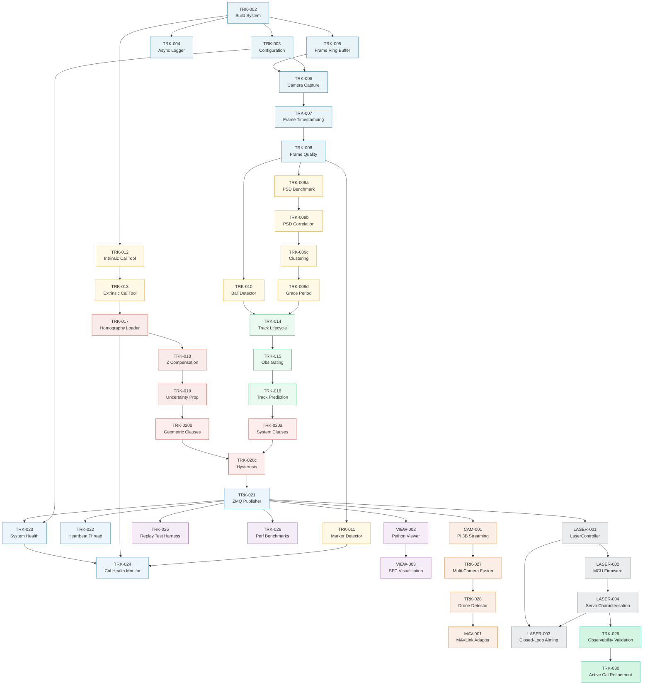

# v0.3+ Dependency Graph — Critical Path

This diagram shows the dependency relationships between tickets. The critical path for v0.3 ship runs through infrastructure → detection → tracking → coordinate mapping → safety predicate → export → validation.



## Critical Path (v0.3 ship)

The longest dependency chain determines minimum elapsed time:

```
TRK-002 → TRK-003 → TRK-006 → TRK-007 → TRK-008 → TRK-009a → 009b → 009c → 009d
  → TRK-014 → TRK-015 → TRK-016 → TRK-020a → TRK-020c → TRK-021 → TRK-025
```

**16 serial steps** on the critical path. Parallel lanes:
- Ball detector (TRK-010) and marker detector (TRK-011) can proceed alongside laser detector.
- Calibration tools (TRK-012, TRK-013) run in parallel with detection work.
- Coordinate mapping (TRK-017→018→019) can proceed once calibration tools are done.
- Viewer (VIEW-002, VIEW-003) runs in parallel once ZMQ publisher exists.

## Execution Order (recommended serial for single developer)

```
TRK-002 → 003 → 004 → 005 → 006 → 007 → 008
  → 009a → 009b → 009c → 009d → 010 → 011
  → 012 → 013 → 014 → 015 → 016
  → 017 → 018 → 019
  → 020a + 020b (parallel) → 020c
  → 021 → 022 → 023 → 024
  → 025 → 026 → VIEW-002 → VIEW-003
```
