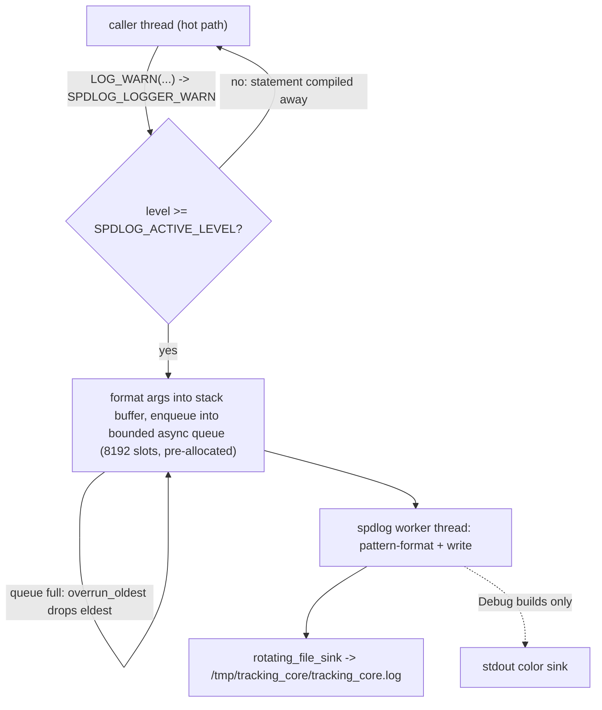

# TRK-004 Async Logger - Plan

## Goal Capsule

- **Objective:** implement the tracking-core async logger (ticket TRK-004): spdlog async ring-buffer logging behind project log macros, tmpfs output configured through the TRK-003 YAML config system, DEBUG/TRACE compiled out of Release builds.
- **Authority:** this plan supersedes the ticket's six-step inline sketch in `docs/tickets/TRK-004-async-logger.md` (numbered U1–U6 there; those IDs do not map to this plan's U1–U5). The logging discipline itself is authoritative in `.claude/rules/cpp.md` §7.1; ADRs win over both on conflict. No ADR covers logging — this work implements an existing rule and needs no new ADR.
- **Stop conditions:** surface (do not self-resolve) any change that would touch `safe_for_control` logic (ADR-007), relax a failing test to pass, or require real-hardware actuation. If the timing assertion proves flaky at generous bounds, report the measurements rather than widening the bound silently.
- **Execution profile:** single developer repo; work on a feature branch; never commit or push without the user asking. Board bookkeeping via `python3 tools/board/ticket_move.py`.

---

## Product Contract

### Summary

Add a `tracking::` logging facility to `tracking_core_lib`: spdlog v1.14.1 (already pinned in CMake) initialised once from `main()` with a pre-allocated async queue and a rotating file sink writing to tmpfs, exposed through `LOG_*` macros that are hot-path safe and compile away DEBUG/TRACE in Release. Configuration comes from a new `logging:` section in `tracking_core.yaml`.

### Problem Frame

The cpp rule §7.1 mandates async, ring-buffered, lock-free logging — no `std::cout`, no synchronous file I/O, no SD-card writes on the hot path — but nothing implements it. Every v0.3 pipeline module queued behind this ticket (capture thread, detectors, tracker, publisher) needs a logger before it can report anything, and the only diagnostics today are two `std::cerr` calls in `src/core/main.cpp` (paths are tracking-core-relative throughout). TRK-004 is one of the two unblocked tickets on the v0.3 mainline; landing it removes a dependency from all subsequent infra work.

### Requirements

**Logger behaviour**

- R1. spdlog is initialised once at startup with an async sink and a bounded queue pre-allocated at init (8192 slots).
- R2. A log call never blocks the calling thread; when the queue is full the oldest message is dropped.
- R3. The log call path performs no heap allocation for messages that fit spdlog/fmt's inline buffer (250 bytes): argument formatting runs on the calling thread into a stack buffer; pattern formatting and file I/O run on the logger's worker thread.

**Macros and gating**

- R4. Project macros `LOG_TRACE`/`LOG_DEBUG`/`LOG_INFO`/`LOG_WARN`/`LOG_ERROR`/`LOG_CRITICAL` resolve to spdlog async calls on the project logger.
- R5. `LOG_DEBUG` and `LOG_TRACE` are compile-time gated: in Release builds the statements (including argument evaluation) compile away.
- R6. A console (stdout) sink is attached in development (Debug) builds only, never in Release.

**Output and configuration**

- R7. Log files go to `/tmp/tracking_core/` (tmpfs on Pi OS) by default, via a rotating file sink; directory is created at init if absent.
- R8. `tracking_core.yaml` gains a `logging:` section with `level`, `output_dir`, `max_file_size_mb`, validated with the same dotted-path error convention as existing sections.
- R9. The camera-open failure message in `main.cpp` becomes a `LOG_ERROR`; the config-load failure keeps `std::cerr` (it fires before the logger can exist — config carries the logger's own settings).

**Testing**

- R10. A unit test asserts logging does not block the calling thread (timing assertion with generous bounds) and that the compile-time gate excludes DEBUG statements when the active level is WARN.

### Scope Boundaries

**Deferred to Follow-Up Work**

- Retrofitting log calls into `detector.cpp`/`tracker.cpp` — modules adopt the macros as they are built or next touched.
- Logger overhead measurement on the Pi 5 — belongs to the TRK-026 benchmark suite; this plan's timing test proves "async, non-blocking", not the latency budget.
- Log-content conventions for `system_health`/thermal events — TRK-023 territory.

**Outside this work's identity**

- A logging ADR. The discipline is already codified in the cpp rule; spdlog is already the build's pinned choice. META-003 (library-set grooming) remains a separate open decision the board tracks.
- Persistent/SD-card log storage or log shipping — the rule forbids hot-path SD writes; anything beyond tmpfs rotation is out.

---

## Planning Contract

### Key Technical Decisions

- **KTD-1 — spdlog-native compile-time gating, not hand-rolled `#ifdef`.** `logging.hpp` defines `SPDLOG_ACTIVE_LEVEL` (guarded by `#ifndef` so a TU can override) from `NDEBUG`: Release → `SPDLOG_LEVEL_INFO`, otherwise `SPDLOG_LEVEL_TRACE`. The `LOG_*` macros wrap `SPDLOG_LOGGER_*`, which compile to nothing (arguments unevaluated) below the active level. Release compiles out exactly DEBUG/TRACE — no more — so `logging.level` stays runtime-meaningful on the deployed build (`info` is selectable; the shipped template still defaults to `warn`), matching §7.1's "WARN+ by default; DEBUG/TRACE compile-time gated" precisely. `init()` emits a WARN when the configured level is below the compiled floor, so a `debug`/`trace` config on a Release binary is observable rather than silent. The ticket's proposed `TRACKING_RELEASE` define is unnecessary — `NDEBUG` (automatic in Release) carries both gates.
- **KTD-2 — overflow policy `async_overflow_policy::overrun_oldest`.** Never block the producer; drop the oldest queued message instead. Same staleness philosophy as ADR-002's `ZMQ_CONFLATE=1`. Consequence accepted: a burst can drop WARN/ERROR messages; 8192 slots makes that rare, and the alternative (blocking the hot path on a full queue) violates §7.1.
- **KTD-3 — spdlog becomes a PUBLIC link dependency of `tracking_core_lib`.** The macro header must include spdlog in consumer TUs (that is what makes gating and format-arg elision zero-cost). The current PRIVATE link would break every consumer of `logging.hpp`. Rejected alternative: an opaque header hiding spdlog — it forces runtime forwarding, losing compile-time gating and allocating for formatting.
- **KTD-4 — introduce build-type handling: default `CMAKE_BUILD_TYPE=Release` when unset.** The project currently sets no build type, so "Release behaviour" is undefined. Defaulting to Release matches the deployment target (Pi 5); developers opt into Debug (`-DCMAKE_BUILD_TYPE=Debug`) to get console output and DEBUG/TRACE. Consequences accepted with eyes open: every default build gets `-O3` + `NDEBUG`, so `assert()` is disabled in default builds (none exists in the codebase today, but future code must account for it), debug symbols are absent, and the default ctest run exercises optimised `NDEBUG` code. Release was chosen over `RelWithDebInfo` because the Pi 5 deployment is the binary that must meet the performance budgets; anyone debugging locally wants full Debug anyway, and a third configuration earns its keep only when a profiling need appears.
- **KTD-5 — the `logging:` config fields are required, not optional-with-default.** TRK-003 established an all-required convention ("All fields below are REQUIRED"); the ticket's "defaults" become the shipped template's values. Level-string validation needs the first membership-check helper (`require_one_of` against spdlog's level names), following the existing dotted-path error message convention.
- **KTD-6 — init order, bootstrap, flush, and re-init contract.** `tracking::logging::init(config.logging)` runs immediately after `Config::load` succeeds and creates `output_dir` (`std::filesystem::create_directories` — startup code, allocation rules don't apply). Init propagates `std::filesystem::filesystem_error` and `spdlog::spdlog_ex` rather than translating them; `main()` handles both via one `const std::exception&` catch (see U4) so failures report on `std::cerr` and exit 1 instead of `std::terminate`. Init also checks whether `output_dir` sits on tmpfs (`statfs`, `f_type == TMPFS_MAGIC`) and emits a single WARN when it does not — `/tmp` is only tmpfs by default from Debian trixie onward, and silently writing rotated logs to the SD card would defeat the §7.1 rule this ticket implements. Flush policy: `flush_on(err)` plus `spdlog::flush_every(3s)` (worker-thread cost only), so errors reach the file promptly; a crash can still lose the last ≤3 s of sub-ERROR messages — accepted. Re-init contract: `init()` drops any existing logger registration first (idempotent-by-replacement) so test fixtures can re-init per case with `shutdown()` in `TearDown()`; production calls it exactly once. `spdlog::shutdown()` flushes on normal exit.
- **KTD-7 — one global project logger.** Registered as spdlog's default and reachable via `tracking::logging::get()`; the macros target it. Per-module named loggers are not needed at v0.3 scale and would multiply configuration surface.

### High-Level Technical Design

Log path — the caller's thread formats arguments into a stack buffer and enqueues (no heap allocation while the message fits fmt's inline buffer); the worker thread applies the output pattern and writes:

Build-type gating summary:

| Build type | `SPDLOG_ACTIVE_LEVEL` | DEBUG/TRACE | INFO and above | Console sink | `NDEBUG` |
|---|---|---|---|---|---|
| Release (default) | `SPDLOG_LEVEL_INFO` | compiled out | runtime-filtered by `logging.level` | absent | defined (by CMake) |
| Debug | `SPDLOG_LEVEL_TRACE` | compiled in, runtime-filtered | runtime-filtered by `logging.level` | attached | undefined |

### Assumptions

- The ticket asserts the Pi 5's `/tmp` is tmpfs, but this is Pi OS release-dependent — Debian made tmpfs `/tmp` the default only in trixie; bookworm leaves it on the SD-card root. Init therefore warns when `output_dir` is not tmpfs (KTD-6), and the Verification Contract carries an on-target `findmnt` check rather than trusting the assumption.
- spdlog v1.14.1's rotating file sink creates missing parent directories, but KTD-6 creates `output_dir` explicitly anyway rather than relying on it.

---

## Implementation Units

### U1. CMake groundwork: build-type default and spdlog visibility

- **Goal:** the build distinguishes Release/Debug and consumers of `tracking_core_lib` can include spdlog headers.
- **Requirements:** R5, R6 (enablers), KTD-3, KTD-4.
- **Dependencies:** none.
- **Files:** `tracking-core/CMakeLists.txt`, `tracking-core/src/core/CMakeLists.txt`.
- **Approach:** default `CMAKE_BUILD_TYPE` to Release when unset (single-config generators), with a status message; promote `spdlog::spdlog` from PRIVATE to PUBLIC on `tracking_core_lib`. No new compile definitions — `NDEBUG` arrives with Release automatically and `logging.hpp` keys off it (KTD-1).
- **Test scenarios:** Test expectation: none — build configuration; proven by U5 building and passing in both configs.
- **Verification:** clean configure+build in default (Release) and `-DCMAKE_BUILD_TYPE=Debug`, zero warnings (`-Wall -Wextra -Wpedantic` policy).

### U2. `logging:` config section

- **Goal:** `Config::load` parses and validates the logger's settings.
- **Requirements:** R8, KTD-5.
- **Dependencies:** none (parallel with U1).
- **Files:** `tracking-core/src/core/include/config.hpp`, `tracking-core/src/core/config.cpp`, `tracking-core/config/tracking_core.yaml`, `tracking-core/README.md`, `tracking-core/tests/cpp_unit/test_config.cpp`.
- **Approach:** add `LoggingConfig { std::string level; std::string output_dir; int max_file_size_mb; }` to `tracking::Config`, mirroring the existing section structs; extend the field walk (`require_section`, `require<T>`) and the semantic pass — new `require_one_of(level, {"trace","debug","info","warn","error","critical"}, "logging.level")` helper, `require_gt(max_file_size_mb, 0, ...)`, `require_nonempty(output_dir, ...)`. Ship template values `warn` / `/tmp/tracking_core/` / `10`; extend the README field table.
- **Patterns to follow:** the six existing sections in `config.cpp`; `ConfigTest` fixture with `write_temp` in `test_config.cpp`.
- **Test scenarios:**
  - Missing `logging:` section → `ConfigError` naming `logging`.
  - `logging.level: verbose` (not in the set) → `ConfigError` naming `logging.level` and listing allowed values.
  - `max_file_size_mb: 0` and `-5` → rejected via `require_gt`.
  - Empty `output_dir` → rejected via `require_nonempty`.
  - Valid section parses into the struct with exact values (happy path).
  - Shipped template still loads (existing `ShippedTemplateLoads` guards drift — extend the template before running it).
- **Verification:** `ctest --output-on-failure` green; template/README/struct agree.

### U3. `logging.hpp` macros and `logging.cpp` initialisation

- **Goal:** the logging facility itself — macros, init, sinks, shutdown.
- **Requirements:** R1–R7, KTD-1, KTD-2, KTD-6, KTD-7.
- **Dependencies:** U1, U2.
- **Files:** `tracking-core/src/core/include/logging.hpp`, `tracking-core/src/core/logging.cpp`, `tracking-core/src/core/CMakeLists.txt` (add source).
- **Approach:** header defines `SPDLOG_ACTIVE_LEVEL` under `#ifndef` from `NDEBUG` (Release → `SPDLOG_LEVEL_INFO`, else `SPDLOG_LEVEL_TRACE`), then includes `<spdlog/spdlog.h>` and defines `LOG_*` wrapping `SPDLOG_LOGGER_*` on `tracking::logging::get()`. `init(const LoggingConfig&)`: drop any existing registration (idempotent-by-replacement per KTD-6), create `output_dir`, warn once if it is not on tmpfs (`statfs`), `spdlog::init_thread_pool(8192, 1)`, rotating sink (`max_file_size_mb`, keep 3 rotated files), stdout colour sink added under `#ifndef NDEBUG`, construct `spdlog::async_logger` with `overrun_oldest`, set runtime level from `logging.level` (WARN once if that level is below the compiled floor), `flush_on(err)` + `spdlog::flush_every(3s)`, register as default. `shutdown()` wraps `spdlog::shutdown()`. Init is startup code — it propagates `filesystem_error`/`spdlog_ex` (KTD-6); document that `init` must be called before any macro use and is not thread-safe against concurrent first use.
- **Patterns to follow:** `#pragma once`, `tracking::` namespace, include ordering and ADR-citing comment style per the cpp rule; cite §7.1 and the ADR-002 CONFLATE analogy at the overflow-policy line.
- **Test scenarios:** covered in U5 (the unit is header+impl; its behaviour is only observable through them).
- **Verification:** library builds in both configs, zero warnings.

### U4. Wire into `main.cpp`

- **Goal:** the binary logs through the facility; console prints reduced to the pre-init path.
- **Requirements:** R9, KTD-6.
- **Dependencies:** U3.
- **Files:** `tracking-core/src/core/main.cpp`.
- **Approach:** wrap `Config::load` and `tracking::logging::init(config.logging)` in a single try block whose catch takes `const std::exception&` (covers `ConfigError`, `std::filesystem::filesystem_error`, and `spdlog::spdlog_ex`), reports the message on `std::cerr`, and exits 1 — the promised stderr path must not become `std::terminate`. Replace the camera-open `std::cerr` with `LOG_ERROR`; flush/shutdown before both the error-exit after init and normal exit.
- **Test scenarios:** Test expectation: none — integration glue; behaviour proven by U5's init/logging tests plus a manual run.
- **Verification:** running `tracking_core` with the shipped config creates `/tmp/tracking_core/tracking_core.log`; a bad config still reports on stderr and exits 1.

### U5. `test_logging.cpp`

- **Goal:** falsifiable evidence for the non-blocking and compile-out claims.
- **Requirements:** R10 (and exercises R1–R7).
- **Dependencies:** U3.
- **Files:** `tracking-core/tests/cpp_unit/test_logging.cpp`, `tracking-core/tests/cpp_unit/CMakeLists.txt` (add source).
- **Approach:** follow the `ConfigTest` fixture style; use `::testing::TempDir()` for `output_dir`; the fixture calls `tracking::logging::shutdown()` in `TearDown()` so each case re-inits cleanly (KTD-6 re-init contract). For gating, define `SPDLOG_ACTIVE_LEVEL SPDLOG_LEVEL_WARN` at the top of the TU before including `logging.hpp` (the `#ifndef` guard makes this the supported override — precedent: the `TRACKING_CORE_CONFIG_TEMPLATE` compile-definition-gated test).
- **Test scenarios:**
  - Init happy path: `init` with a valid `LoggingConfig` creates the directory and a log file appears after a message + flush.
  - Repeated init: two `init` calls with different configs in one process succeed; the second replaces the first (no duplicate-registration throw).
  - Non-blocking timing: enqueue 1,000 `LOG_WARN` messages and assert total wall time < 250 ms (generous — synchronous file writes of the same volume are far slower; the bound proves "enqueue, not write" without being flaky on a loaded dev machine or the Pi).
  - Compile-time gate: with the TU's active level at WARN, `LOG_DEBUG("side effect {}", fn())` must not evaluate `fn()` (counter stays 0) and nothing reaches the sink.
  - NDEBUG mapping: a second TU with no override `static_assert`s that `SPDLOG_ACTIVE_LEVEL == SPDLOG_LEVEL_INFO` under `NDEBUG` and `== SPDLOG_LEVEL_TRACE` otherwise, so the header's default branch is proven in both build configs — the hand-set override above never exercises it.
  - Runtime level: with `logging.level: error`, a `LOG_WARN` does not reach the sink; `LOG_ERROR` does.
  - Overflow policy: flood well past 8192 queued messages without blocking (completes within the timing bound); message loss is acceptable and not asserted.
  - Rotation smoke: with `max_file_size_mb: 1`, writing >1 MB produces a rotated file alongside the active one.
- **Verification:** `ctest --output-on-failure` green in Debug and Release; the timing test's bound documented in-line with its rationale.

---

## Verification Contract

| Gate | Command | Applies to |
|---|---|---|
| Build, zero warnings | `cmake -S tracking-core -B tracking-core/build && cmake --build tracking-core/build` | U1, U3, U4 |
| Debug config build | same with `-DCMAKE_BUILD_TYPE=Debug` in a second build dir | U1, U5 |
| Unit tests | `cd tracking-core/build && ctest --output-on-failure` | U2, U5 |
| Manual smoke | run `tracking_core` with the shipped config; inspect `/tmp/tracking_core/` | U4 |
| On-target tmpfs check | `findmnt -T /tmp` on the deployment Pi 5 confirms tmpfs before declaring R7 met (init's mount warning is the runtime backstop) | R7, deployment |

Quality gates: never relax a failing assertion to pass (CLAUDE.md §5); the dev machine differs from the Pi 5, so a local pass is necessary but final performance claims wait for TRK-026 on-target (per the TRK-002 handoff learning in `docs/solutions/workflow/2026-06-04-tracking-core-rename-and-build-overhaul-handoff.md`).

## Definition of Done

- All five units implemented; both build configs compile with zero warnings and all ctest suites pass in each.
- All R1–R10 traceable to landed code or a named test.
- Config template, `LoggingConfig` struct, validation, and README field table mutually consistent (the `ShippedTemplateLoads` test is the drift guard).
- No `std::cout`/`std::cerr`/`printf` remains in tracking-core C++ outside the documented pre-init path in `main.cpp`.
- Ticket bookkeeping: `TRK-004` moved via `ticket_move.py` with a Log entry linking this plan; its front-matter `depends_on` corrected to `["TRK-002", "TRK-003"]` (the Log line already says TRK-003; the front-matter omits it).
- No dead-end or experimental code left in the diff.
