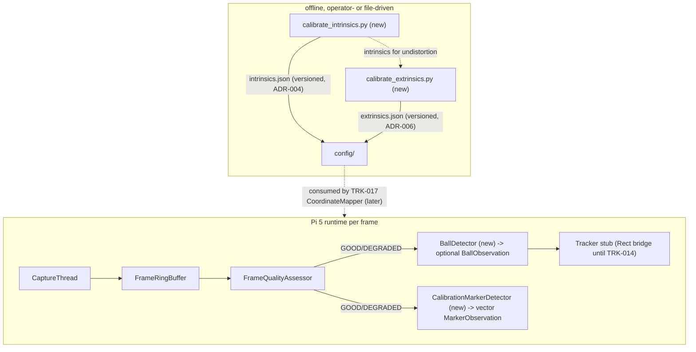

# Detection and Calibration Cluster (TRK-010..013) - Plan

## Goal Capsule

- **Objective:** implement the four unblocked v0.3 tickets — TRK-010 (ball detector), TRK-011 (calibration marker detector), TRK-012 (intrinsic calibration tool), TRK-013 (extrinsic calibration tool) — to their ticket Acceptance criteria, with every design fork pre-decided below.
- **Authority:** the ticket story files in `docs/tickets/` carry the acceptance criteria; this plan resolves their design forks and supersedes their inline U-ID sketches. ADR-004/ADR-006/ADR-010 are authoritative for the calibration contract; `.claude/rules/cpp.md` §7.1 for hot-path discipline; `.claude/rules/python.md` for the Python tools. Never cite ADR-009.
- **Stop conditions (surface, do not self-resolve):** anything touching `safe_for_control` logic; any need to actuate the laser or any hardware; a contradiction with an accepted ADR. A replay false-positive gate failure is NOT a halt: follow the gate-failure protocol in U3 (record measured counts, mark the ticket done-with-deferral, document in the PR) — never relax the assertion, never tune thresholds to pass.
- **Execution profile:** single feature branch (`feat/v03-detection-calibration`), one PR against `master` at the end titled `feat(tracking-core): detection + calibration cluster (TRK-010..013)`. Commit mapping: U1 → the TRK-010 commit; U2 → the TRK-011 commit; U3 → a `test(tracking-core):` commit after both; U4+U5 → the TRK-012 commit; U6 → the TRK-013 commit; plus one review-fix commit. Move each ticket via `python3 tools/board/ticket_move.py` with an evidence note when its unit completes; commit story+board with the code. Never merge the PR. Both build configs must be zero-warning and fully green before every commit; `tools/pi5-remote-test.sh` is the on-target gate.
- **Executor calibration:** this plan is written for autonomous execution by a model that should not re-open design decisions. When implementation reveals a genuine gap the plan does not cover, pick the smallest option consistent with the KTDs, note it in the ticket Log, and continue — reserve blockers for the stop conditions above.

---

## Product Contract

### Summary

Two C++ per-frame detectors join the pipeline behind the quality gate — a contour/circularity ball detector and an ArUco/Charuco marker detector — plus two offline Python CLIs that produce the versioned intrinsics/extrinsics JSON the core will consume: the first real calibration data producers for `config/intrinsics.json` and `config/extrinsics.json`.

### Problem Frame

Detection is the front of everything queued on the board: tracking (TRK-014..016) needs ball observations, calibration health (ADR-004 Phase 2) needs marker observations, and coordinate mapping (TRK-017..019) needs the calibration JSON files that do not exist yet. All four tickets' dependencies are `done`. The laser detector (TRK-009x) stays excluded: it requires modulated-laser recordings, and laser actuation is blocked pending the `real-hardware-actuation` skill.

### Requirements

**Ball detector (TRK-010)**

- R1. `BallDetector::detect(const cv::Mat&) -> std::optional<BallObservation>` — blob isolation (blur → threshold → morphological close → contours), filtered by area, circularity > threshold, convexity; best candidate by circularity × area; `nullopt` when nothing passes.
- R2. `BallObservation`: `centroid_px` (sub-pixel via moments), `radius_px` (from contour area), `confidence`, `circularity`.
- R3. `detect()` performs no heap allocation after construction: working Mats pre-allocated, contour vectors `reserve()`d (ticket §7.1 requirement; the ≤2 ms Pi 5 budget is verified by TRK-026, recorded as deferred).
- R4. Config: `ball.expected_radius_px_min/max`, `ball.min_circularity`, `ball.detection_blur_kernel` — required fields, validated, shipped defaults marked provisional (KTD-6).

**Marker detector (TRK-011)**

- R5. `CalibrationMarkerDetector::detect(const cv::Mat&) -> std::vector<MarkerObservation>` with `marker_id`, 4 `corners_px`, `centroid_px`, `reprojection_quality`; sub-pixel corner refinement.
- R6. Works identically on OpenCV 4.6 (dev box) and 4.10 (Pi 5) via the KTD-2 version seam; configurable dictionary (default `4X4_50`), `calibration.marker_ids` for the ADR-004 Phase 2 health markers.

**Calibration tools (TRK-012/013)**

- R7. `tools/calibrate_intrinsics.py`: Charuco frames in → `cv2.calibrateCamera` via the modern CharucoDetector path → versioned JSON per the ticket schema at `calibration.intrinsics_path`; rejects when reprojection error > 1.0 px.
- R8. `tools/calibrate_extrinsics.py`: ≥4 marker-to-floor correspondences → `cv2.findHomography` (RANSAC) → versioned JSON per the ticket schema; rejects fewer than 4 points, near-collinear layouts, reprojection error > 0.020 m (ADR-004 `CAL_HEALTH_FAIL_M`) or > 3.0 px (ADR-006 gate).
- R9. Both tools are file-driven first (directory of images / a clip in, JSON out) — the tested path; live-camera capture is a thin optional flag whose verification is bench-deferred (KTD-5).

**Cross-cutting**

- R10. Replay gates: with shipped defaults, quality-gated frames from the TRK-031 room recordings produce zero ball and zero marker detections, and composite true-positive frames are detected (env-gated integration tests; an FP failure follows U3's gate-failure protocol — recorded counts and done-with-deferral, never threshold tuning).
- R11. Every new numeric default ships with a provenance comment (guessed vs measured) in `tracking_core.yaml`; synthetic-green alone never marks a detection ticket done without the replay gates also green on the Pi 5 (KTD-6).

### Scope Boundaries

**Deferred to Follow-Up Work**

- On-target timing budgets (≤2 ms per detector, TRK-012 tool runtime) — TRK-026's benchmark suite; record as deferred in ticket Logs, mirroring TRK-008's precedent.
- Live true-positive verification (real foam ball in scene, printed Charuco board) — requires the operator at the bench; each ticket Log records exactly what awaits bench time.
- C++ loader for the intrinsics/extrinsics JSON (core-side consumption) — TRK-017's scope; these tools only produce the files.
- Real-scene detector threshold recalibration — new replay scenarios with the ball/board present, recorded at bench time via `tools/record-scenarios-pi3b.sh` (name is correct: the camera lives on the Pi 3B; clips are stored on the Pi 5).
- TRK-011's C++ Charuco-board mode (`interpolateCornersCharuco`) — deliberately moved to the Python tools (KTD-2 scope note); revisit only if a runtime C++ consumer appears.

**Outside this phase's identity**

- TRK-009x laser detection (blocked on hardware actuation policy); tracker changes (TRK-014..016); any ZMQ schema work (TRK-021); pydantic adoption (`.claude/rules/python.md` mandates it for ZMQ consumers, not for these JSON producers — stdlib `json` + explicit checks suffice here).

---

## Planning Contract

### Key Technical Decisions

- **KTD-1 — `BallDetector` replaces the stub `Detector`; the stub `Tracker` stays.** `src/core/tracking/detector.cpp` and its declaration in `tracking_pipeline.hpp` are placeholders returning a fixed box. Delete the stub `Detector`; `main.cpp` calls `BallDetector` and bridges its `BallObservation` into the `cv::Rect` the stub `Tracker` still consumes (centroid ± radius) until TRK-014 replaces the tracker. No interface/polymorphism is introduced — concrete classes, matching the codebase.
- **KTD-2 — ArUco version seam, specified exactly.** Dev box OpenCV 4.6 has only the free-function API (`cv::aruco::detectMarkers`, `DetectorParameters::create()`, `getPredefinedDictionary`); Pi 5's 4.10 has the class API (`cv::aruco::ArucoDetector`). `calibration_marker_detector.cpp` isolates the difference in one private helper guarded by `#if CV_VERSION_MAJOR == 4 && CV_VERSION_MINOR < 7` — legacy free functions on the old branch, `ArucoDetector` member on the new. The **includes are part of the seam**: include `<opencv2/core/version.hpp>` first so the guard macros exist, then the old branch includes `<opencv2/aruco.hpp>` (contrib) and the new branch `<opencv2/objdetect/aruco_detector.hpp>`. The public `MarkerObservation` surface is identical on both. Do not rely on deprecated compat shims existing in 4.10. Scope note: this class does **individual-marker detection only** — the TRK-011 ticket's "Charuco board mode" (`interpolateCornersCharuco`) is deliberately not implemented in C++; board-level detection lives in the Python calibration tools (KTD-3), and the C++ runtime consumer (ADR-004 Phase 2 health monitoring, TRK-024) needs individual markers only. Record this as a scope deferral in the TRK-011 ticket Log.
- **KTD-3 — Modern Charuco API on the Python side.** pip installs OpenCV ≥4.8, where `cv2.aruco.calibrateCameraCharuco` (named in the TRK-012 ticket) no longer exists. Use the current path: `cv2.aruco.CharucoDetector.detectBoard` → `CharucoBoard.matchImagePoints` → `cv2.calibrateCamera`. Pin `opencv-python>=4.8` in `tracking-core/requirements.txt` so the ticket's legacy names are never attempted.
- **KTD-4 — Charuco board geometry: both square counts odd, as future-proofing.** The ChArUco pattern algorithm changed **at** OpenCV 4.6.0 (`setLegacyPattern()` restores pre-4.6 patterns for even row counts) — every environment in play (C++ 4.6.0 dev, C++ 4.10 Pi, Python ≥4.8) is post-change, so they already agree; the odd-count constraint guards against future legacy-pattern printouts and any rows-vs-columns axis confusion, nothing more. Configured board: `squares_x: 5, squares_y: 7` (both odd), `square_length_m: 0.025`, `marker_length_m: 0.020`, `DICT_4X4_50`, under `calibration.charuco.*` — physical lengths are provisional until a board is printed and measured (KTD-6). Validation messages describe the constraint as future-proofing, not as a live 4.6-vs-4.10 incompatibility.
- **KTD-5 — File-driven calibration tools.** Primary mode: `--images <dir>` (or a video file) plus, for extrinsics, a layout JSON of known floor coordinates; output JSON written atomically. `--camera <id>` live capture exists as a thin wrapper over the same pipeline, excluded from tests, marked bench-verification-pending in the ticket Log. This is what makes TRK-012/013 remotely executable and testable; it reweights the tickets' interactive-capture emphasis deliberately (confirmed at scoping).
- **KTD-6 — Provisional-defaults discipline (the TRK-008 lesson).** TRK-008 shipped a guessed `blur_threshold: 100` that rejected 64/64 real frames; replay testing caught it and the measured default is 12. Therefore: every new numeric default in this phase carries a `# provisional — guessed, pending real-footage validation` comment in `tracking_core.yaml`; the replay false-positive gates (R10) run with shipped defaults on the Pi 5 before any ticket is done; true-positive thresholds get their measured provenance at bench time. Synthetic tests prove the algorithm, not the numbers.
- **KTD-7 — Detector placement follows the flat-include convention.** Headers at `src/core/include/ball_detector.hpp` and `src/core/include/calibration_marker_detector.hpp` (the tickets' `src/core/detection/` path is superseded by repo convention — same call TRK-008 logged); implementations under `src/core/tracking/`; both mirror `FrameQualityAssessor`'s shape: config struct + `(config, rows, cols)` constructor pre-allocating working buffers, per-frame method that never allocates, plain counter members with const accessors.
- **KTD-8 — Python testing shape.** Tests live in `tests/python_integration/` (pytest from `tracking-core/` root, matching `test_viewer_utils.py`'s import style); synthetic Charuco/ArUco scenes are generated in-test via `cv2.aruco` board/marker image generation — hermetic, no recordings needed. `tracking-core/requirements.txt` gains `pytest` and `pyyaml` alongside the `opencv-python>=4.8` pin (the tools read the YAML config for default output paths; the DoD's clean-install gate needs pytest installable from the same file). Environment: repo convention invokes `python3`/`pytest` directly with no venv; if the machine's Python is externally managed (PEP 668 blocks bare `pip install`), create a local `.venv`, install the requirements there, and note it in the ticket Log — do not fight the environment or install with `--break-system-packages`.

### High-Level Technical Design

Detection stage placement and the calibration data path (new components bold):

ArUco API seam (KTD-2):

| Surface | OpenCV 4.6 (dev) | OpenCV 4.10 (Pi 5) |
|---|---|---|
| Marker detection | `cv::aruco::detectMarkers(img, dict, corners, ids, params)` | `ArucoDetector(dict, params).detectMarkers(img, corners, ids)` |
| Parameters | `DetectorParameters::create()` (Ptr factory) | `DetectorParameters()` (value type) |
| Dictionary | `getPredefinedDictionary(DICT_4X4_50)` | same name, returns value type |
| Guard | `#if CV_VERSION_MAJOR == 4 && CV_VERSION_MINOR < 7` selects the branch; public API of `CalibrationMarkerDetector` identical | |

### Assumptions

- The Pi 5's OpenCV 4.10 python bindings are not required (Python tools run wherever `pip install -r requirements.txt` ran — the dev box or the Pi; tests run on both via the existing gates).
- The TRK-031 room recordings contain no ball-like circular blob and no ArUco patterns; if reality disagrees, the R10 gate failure is surfaced, not suppressed.
- `cv::cornerSubPix` refinement operates on the grayscale frame for TRK-011 exactly as on 4.6 and 4.10 (imgproc API, stable across versions).

---

## Implementation Units

### U1. BallDetector (TRK-010)

- **Goal:** per-frame ball detection with the ticket's contour/circularity pipeline, replacing the stub `Detector`.
- **Requirements:** R1, R2, R3, R4; KTD-1, KTD-6, KTD-7.
- **Dependencies:** none.
- **Files:** `tracking-core/src/core/include/ball_detector.hpp` (new), `tracking-core/src/core/tracking/ball_detector.cpp` (new), `tracking-core/src/core/tracking/detector.cpp` (delete), `tracking-core/src/core/include/tracking_pipeline.hpp` (remove `Detector`, keep `Tracker`), `tracking-core/tests/cpp_unit/test_tracking_pipeline.cpp` (delete the `DetectorTest`, keep `TrackerTest`), `tracking-core/src/core/main.cpp`, `tracking-core/src/core/include/config.hpp`, `tracking-core/src/core/config.cpp`, `tracking-core/config/tracking_core.yaml`, `tracking-core/README.md`, `tracking-core/src/core/CMakeLists.txt`, `tracking-core/tests/cpp_unit/test_ball_detector.cpp` (new), `tracking-core/tests/cpp_unit/test_config.cpp`, `tracking-core/tests/cpp_unit/CMakeLists.txt`.
- **Approach:** mirror `FrameQualityAssessor`: `BallDetectorConfig` aggregate in `config.hpp` (`expected_radius_px_min/max` int, `min_circularity` double, `detection_blur_kernel` odd int, `brightness_threshold` int in [1,254]), validated with the `require_*` family (`min < max`, circularity in (0,1], kernel odd and in [3,15]); constructor `(config, rows, cols)` pre-allocates gray/blur/binary working Mats and `reserve()`s the contour vectors; `detect()` = grayscale → Gaussian blur → **fixed brightness-prior threshold** (`cv::threshold` at `ball.brightness_threshold`) → morph close → `findContours` → filter (area from radius bounds, circularity `4πA/P²`, convexity) → best by circularity×area → centroid via `cv::moments`, `radius_px = sqrt(area/π)`. Fixed threshold, not Otsu, deliberately: Otsu always segments *something* on a ball-free scene (it splits whatever histogram exists), which structurally conflicts with the U3 zero-false-positive gate; a fixed brightness prior matches the ticket's own framing (the ball is "distinguishable by relative brightness" under NoIR) and returns an empty binary image on scenes with nothing bright — monotonically tunable at bench time. `confidence` = circularity (documented as the provisional formula; TRK-015 may redefine it). `main.cpp`: replace `Detector` with `BallDetector`; bridge the observation to a `cv::Rect` for the stub `Tracker` (centroid ± radius; on `nullopt` pass an empty `cv::Rect`, preserving the stub's hold-last-box behaviour); count detections for the existing 1 Hz report. All five config defaults marked provisional (KTD-6). Note: `cv::findContours` allocates its output vectors internally on OpenCV 4.x — pre-`reserve()` the reused vectors and document that residual library allocation in the header (same honesty as the ring buffer's formal-race note); the strict no-alloc claim applies to our code paths.
- **Patterns to follow:** `frame_quality.hpp/.cpp` (buffer prealloc, config struct, counters); config test sweep discipline from `test_config.cpp` (every existing inline YAML gains the new required `ball.*` fields — there are ~15 literals; update them all, and the `kValidYaml` assertions).
- **Test scenarios:**
  - Synthetic white circle (r=30) on dark background → detected; centroid within 1 px of truth; `radius_px` within 10%; circularity > 0.9.
  - Empty/uniform frame → `nullopt`.
  - Two blobs, one square one circular, both in area range → the circular one wins.
  - Circle smaller than `expected_radius_px_min` and larger than `max` → `nullopt` (both directions).
  - Ball centred at a frame corner (half visible) → either detected with degraded circularity or `nullopt`; assert no crash and no observation with out-of-range radius (edge behaviour documented by the test, not guessed).
  - Config validation: min ≥ max rejected; circularity 0 and 1.5 rejected; even blur kernel rejected; happy-path values parse.
  - BGR and grayscale inputs both work (conversion path).
- **Verification:** both configs build zero-warning; all ctest suites green; `tracking_core` binary still runs the smoke path (camera-failure exit) unchanged.

### U2. CalibrationMarkerDetector (TRK-011)

- **Goal:** ArUco/Charuco marker detection with identical behaviour on OpenCV 4.6 and 4.10.
- **Requirements:** R5, R6; KTD-2, KTD-4, KTD-7.
- **Dependencies:** none (parallel with U1; serialize commits U1 then U2).
- **Files:** `tracking-core/src/core/include/calibration_marker_detector.hpp` (new), `tracking-core/src/core/tracking/calibration_marker_detector.cpp` (new), `tracking-core/src/core/include/config.hpp`, `tracking-core/src/core/config.cpp`, `tracking-core/config/tracking_core.yaml` (`calibration.aruco_dictionary`, `calibration.marker_ids`, `calibration.charuco.squares_x/squares_y/square_length_m/marker_length_m`), `tracking-core/README.md`, `tracking-core/src/core/CMakeLists.txt`, `tracking-core/tests/cpp_unit/test_calibration_marker_detector.cpp` (new), `tracking-core/tests/cpp_unit/test_config.cpp`, `tracking-core/tests/cpp_unit/CMakeLists.txt`.
- **Approach:** `MarkerObservation` POD per the ticket, except the quality field is named `corner_residual_px` — the mean `cv::cornerSubPix` refinement residual — because the ticket's `reprojection_quality` name promises geometric-reprojection information the value does not carry (record the naming deviation in the TRK-011 Log; TRK-024 must not treat it as a reprojection metric). The KTD-2 seam is confined to one `.cpp`-private detection helper plus the guarded includes. Dictionary configured by name via `require_one_of` over the supported set (start with `4X4_50`, `4X4_100`, `5X5_50`). `marker_ids` needs the config system's first sequence read: add a `require_int_list` helper beside the existing `require<T>` family using `node.as<std::vector<int>>()` with `YAML::BadConversion` mapped to `ConfigError` carrying the dotted path; per-element ≥ 0; an **empty list is rejected** (ADR-004 Phase 2 health monitoring needs at least one static marker). Charuco geometry fields validated (odd `squares_x`/`squares_y` per KTD-4's future-proofing rationale; lengths > 0, marker < square). Note `calibration.intrinsics_path`/`extrinsics_path` already exist in the config (TRK-003) — no new path fields are added. Sweep discipline: every inline YAML literal in `test_config.cpp` gains the new required `calibration.*` fields (same ~16-literal sweep U1 does for `ball.*` — coordinate the two sweeps in whichever unit lands second).
- **Patterns to follow:** U1's structure; `require_one_of` from `config.cpp`.
- **Test scenarios:**
  - Synthetic marker image (generated in-test via the version-appropriate generate call, id 7, 200 px) pasted onto a background → detected with correct id; corners within 1 px.
  - Rotated 30° and perspective-warped marker → detected, id correct.
  - Frame with no markers → empty vector.
  - Two markers, ids 3 and 9 → both returned with correct ids.
  - Dictionary mismatch (marker from `5X5_50`, detector on `4X4_50`) → empty vector.
  - Config validation: unknown dictionary name rejected listing allowed values; even `squares_y` rejected; marker_length ≥ square_length rejected.
- **Verification:** green on the dev box (4.6 branch of the seam) via ctest AND on the Pi 5 (4.10 branch) via `tools/pi5-remote-test.sh` — both branches of the `#if` must be compiled and tested before the unit is done.

### U3. Replay gates for both detectors (false-positive + composite true-positive)

- **Goal:** the shipped detector defaults run against real room footage — zero false positives on quality-gated frames, and a composite true-positive check that bounds default strictness from the other side (R10, R11, KTD-6).
- **Requirements:** R10, R11.
- **Dependencies:** U1, U2.
- **Files:** `tracking-core/tests/cpp_unit/test_replay_integration.cpp` (extend), `tracking-core/config/tracking_core.yaml` (provenance comments only).
- **Approach:** extend the existing `ReplayIntegration` fixture (env-gated on `TRACKING_REPLAY_DIR`; shipped template config via `TRACKING_CORE_CONFIG_TEMPLATE`). The recordings that exist on the Pi 5 are `normal.avi`, `underexposed.avi`, `overexposed.avi` (TRK-031). **Frames are pre-filtered through `FrameQualityAssessor` first** — the FP assertions apply only to GOOD/DEGRADED frames, matching the production contract (the diagram feeds detectors only quality-passed frames); the raw underexposed clip run is informational only: log its detection counts, assert nothing. **True-positive counterweight:** composite frames — the U1 synthetic ball pasted at an in-range radius onto real GOOD frames extracted from `normal.avi` — must be detected in ≥ 90% of composites; this stops uselessly strict defaults (e.g. circularity 0.95 + a narrow radius band) from sailing through the FP gate and shipping a detector with no recall. **Gate-failure protocol (not a halt):** if an FP assertion fails on-target with shipped defaults, record the measured per-clip counts in the ticket Log and the PR's Known Residuals, mark the ticket done-with-deferral (recalibration is bench work with new scenario recordings), and continue the phase — the assertion itself is never weakened and thresholds are never tuned to pass.
- **Patterns to follow:** the existing three `ReplayIntegration` tests (skip-when-unset, shipped-template loading).
- **Test scenarios:**
  - `normal.avi`, quality-gated frames → 0 ball detections (message reports frames assessed and counts).
  - `normal.avi`, quality-gated frames → 0 marker detections.
  - `underexposed.avi`, quality-gated frames (few will pass the gate) → 0/0 on those that do; raw-clip counts logged informationally.
  - Composite true-positive: ball pasted onto ≥ 10 real GOOD frames → detected in ≥ 90%, centroid within 2 px of the paste position.
- **Verification:** `tools/pi5-remote-test.sh` passes with the new gates included (both configs); the run report shows the gates executed, not skipped, on the Pi 5.

### U4. Synthetic Charuco scene generation (shared Python test utility)

- **Goal:** one hermetic generator both calibration tools' tests use: rendered Charuco board views with known geometry.
- **Requirements:** R7, R8 enablers; KTD-3, KTD-4, KTD-8.
- **Dependencies:** none (Python side; parallel with U1–U3).
- **Files:** `tracking-core/tests/python_integration/conftest.py` (new — fixtures), `tracking-core/requirements.txt` (pin `opencv-python>=4.8`; add `pytest`, `pyyaml` per KTD-8), `tracking-core/tests/python_integration/test_synthetic_board.py` (new — sanity tests for the generator itself).
- **Approach:** a pytest fixture that builds the configured 5×7 `DICT_4X4_50` board via `cv2.aruco.CharucoBoard` and generates **pose-projected captures from one consistent pinhole camera** — this is load-bearing for U5's focal-length assertion: fix a ground-truth `K_true` (f = 800 px, centred principal point, zero distortion) and render **N = 12** views by projecting the board plane through `H_i = K_true · [r1_i r2_i | t_i]` with rotations sampled across ±15–35° about both axes plus varied translations, written to a tmp dir. Arbitrary/random homographies are forbidden — they correspond to no single camera and `calibrateCamera` converges to garbage; near-fronto-parallel-only sets leave focal length unobservable. The fixture exposes `K_true` so U5's assertion compares against it by construction. Keep it flat-function style per `.claude/rules/python.md` (type hints, black/ruff clean).
- **Patterns to follow:** `tests/python_integration/test_viewer_utils.py` import/rootdir convention; `tools/record_camera.py` minimalism.
- **Test scenarios:**
  - Generated board image is detected by `cv2.aruco.CharucoDetector.detectBoard` with ≥ 12 Charuco corners (sanity that generation and detection agree — this is the KTD-4 cross-version pattern check in miniature).
  - Warped view still yields ≥ 4 corners with correct ids.
- **Verification:** `pytest tests/python_integration/` green from `tracking-core/` root after `pip install -r requirements.txt`.

### U5. calibrate_intrinsics.py (TRK-012)

- **Goal:** file-driven intrinsics calibration producing the ticket's versioned JSON.
- **Requirements:** R7, R9; KTD-3, KTD-5.
- **Dependencies:** U4.
- **Files:** `tracking-core/tools/calibrate_intrinsics.py` (new), `tracking-core/tests/python_integration/test_calibrate_intrinsics.py` (new), `tracking-core/config/tracking_core.yaml` (`calibration.charuco.*` lands in U2; referenced here).
- **Approach:** argparse: `--images <dir>` (primary) | `--camera <id> --frames N` (thin live wrapper, untested, bench-pending per KTD-5), `--output` (default read from `tracking_core.yaml`'s existing `calibration.intrinsics_path` via pyyaml), `--max-reprojection-error` (default 1.0 px). Pipeline: CharucoDetector.detectBoard per image → accumulate `matchImagePoints` correspondences → `cv2.calibrateCamera` with `CALIB_FIX_K3 | CALIB_ZERO_TANGENT_DIST` (the synthetic camera is distortion-free; real recalibration at bench time may lift the flags — note in the tool's help text) → JSON exactly per the ticket schema (`intrinsics_version: 1`, `camera_id`, `camera_matrix` serialized as a 3×3 nested array `[[fx,0,cx],[0,fy,cy],[0,0,1]]`, `dist_coeffs` as a flat array in `calibrateCamera` output order, `image_size` as `[w,h]`, `reprojection_error_px`, ISO-8601 `calibration_timestamp`); atomic write (tmp + rename); non-zero exit with operator guidance when error exceeds the threshold or fewer than a minimum number of usable views (default 8) were found.
- **Patterns to follow:** `record_camera.py` CLI shape; stdlib `json` (no pydantic — Scope Boundaries).
- **Test scenarios:**
  - U4's synthetic capture set → exit 0, JSON exists, schema keys all present, `reprojection_error_px < 1.0`, camera matrix within 15% of the synthetic ground-truth focal length.
  - Threshold forced to an impossibly small value (`--max-reprojection-error 0.001`) → non-zero exit, no JSON written.
  - Directory with too few detectable views → non-zero exit with the guidance message.
  - Output path unwritable → clean error, non-zero exit.
- **Verification:** pytest green; running the tool by hand on the synthetic dir produces a JSON that `python3 -m json.tool` accepts.

### U6. calibrate_extrinsics.py (TRK-013)

- **Goal:** file-driven floor-homography calibration with ADR-004/006 validation gates.
- **Requirements:** R8, R9; KTD-5.
- **Dependencies:** U4, U5 (uses an intrinsics JSON for undistortion).
- **Files:** `tracking-core/tools/calibrate_extrinsics.py` (new), `tracking-core/tests/python_integration/test_calibrate_extrinsics.py` (new).
- **Approach:** argparse: `--image <file>` + `--layout <json>` (marker_id → floor x,y metres; the primary mode) | interactive click mode explicitly out of scope this phase (KTD-5 — the layout file replaces it); `--intrinsics <json>` for undistortion before homography. Homography fit: `cv2.findHomography(method=0)` — plain least squares, **not RANSAC** — because anchors are few, hand-measured correspondences, and OpenCV's `ransacReprojThreshold` default of 3.0 is in destination units (**metres** here), which silently degenerates RANSAC to least squares anyway while inviting an executor to mask a bad anchor as an "outlier"; a bad anchor must FAIL the gate, not be excluded from it. Reprojection error is computed over **all** supplied anchors, never an inlier subset. Validation gates in order, each with a named-gate message: ≥ 4 anchors (with a printed warning at exactly 4 that the fit is exact and the error gates carry no information — recommend ≥ 5); non-collinearity via SVD of the mean-centred N×2 floor-coordinate matrix, reject when `σ2/σ1 < 1e-3` (threshold commented provisional per KTD-6); metric reprojection ≤ 0.020 m (`CAL_HEALTH_FAIL_M`); pixel reprojection ≤ 3.0 px (ADR-006). Output JSON per the ticket schema: `homography_3x3` as a nested 3×3 array, `floor_anchor_points` as an array of objects `{"marker_id": int, "floor_x_m": float, "floor_y_m": float, "image_x_px": float, "image_y_px": float}` (per ADR-006 the frame must be re-derivable), plus `"undistorted_coordinates": true` — the homography is valid only on undistorted pixels, and TRK-017's consumer must be able to read that contract from the artifact. Atomic write; non-zero exits.
- **Patterns to follow:** U5's structure and error style.
- **Test scenarios:**
  - Synthetic scene with 6 markers at known floor positions under a known homography → recovered H reprojects all anchors within 0.005 m; exit 0; JSON schema complete including `undistorted_coordinates: true`.
  - Only 3 anchors → rejected naming the ≥4 gate.
  - 5 exactly-collinear anchors → rejected naming the degeneracy gate.
  - 5 nearly-collinear anchors (one anchor 2 mm off the line of the other four) → rejected by the σ2/σ1 check (forces the threshold to be real, not just the exact-zero case).
  - One anchor perturbed to force reprojection error past 0.020 m → rejected naming the threshold and the measured value.
  - Missing/invalid intrinsics file → clean error.
- **Verification:** pytest green; the produced JSON round-trips through `json.load` and contains the exact ADR-mandated keys.

---

## Verification Contract

| Gate | Command | Applies to |
|---|---|---|
| C++ build + tests, both configs | `cmake --build tracking-core/build` / `build-debug`, then `ctest --output-on-failure` in each | U1–U3 |
| Zero warnings | build output greps clean (`-Wall -Wextra -Wpedantic` policy) | every commit |
| Python tests | `pytest tests/python_integration/` from `tracking-core/` (after `pip install -r tracking-core/requirements.txt`) | U4–U6 |
| On-target gate | `tools/pi5-remote-test.sh` — must show the U3 replay gates executed (not skipped) and green on the Pi 5 | U2 (4.10 seam branch), U3, phase end |
| Board hygiene | `python3 tools/board/board_check.py` after each ticket move | every ticket |

Quality gates: never relax a failing assertion (CLAUDE.md §5); a replay-gate failure is reported with measured counts, not tuned away; per-ticket board moves carry evidence notes citing test counts and what was deferred (TRK-008's Log entries are the model).

## Definition of Done

- U1–U6 implemented; all four tickets moved to `done` with evidence notes; `board_check` clean.
- R1–R11 each traceable to landed code, a named test, or an explicit Log-recorded deferral (the ≤2 ms budgets and live-capture verification are the expected deferrals).
- Both C++ configs zero-warning and fully green locally AND on the Pi 5 via `tools/pi5-remote-test.sh`, with the U3 gates executed on-target — green, or failed with the U3 gate-failure protocol fully applied (counts in ticket Log + PR Known Residuals, done-with-deferral recorded).
- `pytest` green from a clean `pip install -r tracking-core/requirements.txt`.
- Every new YAML default carries a provenance comment; provisional values say so.
- A code review ran before the PR; mechanical findings applied; residuals recorded in the PR body.
- One PR open against `master` (title per Goal Capsule) with testing evidence, deferral list, and Known Residuals; not merged.
- No dead-end or experimental code left in the diff; the deleted `Detector` stub leaves no dangling references.
