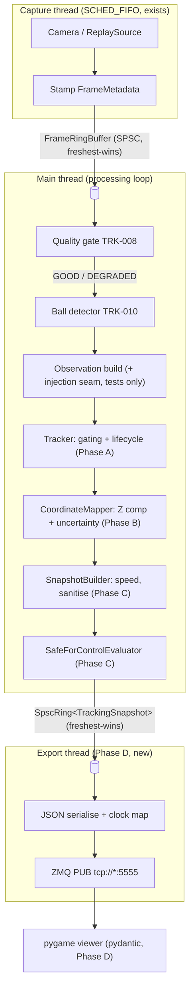
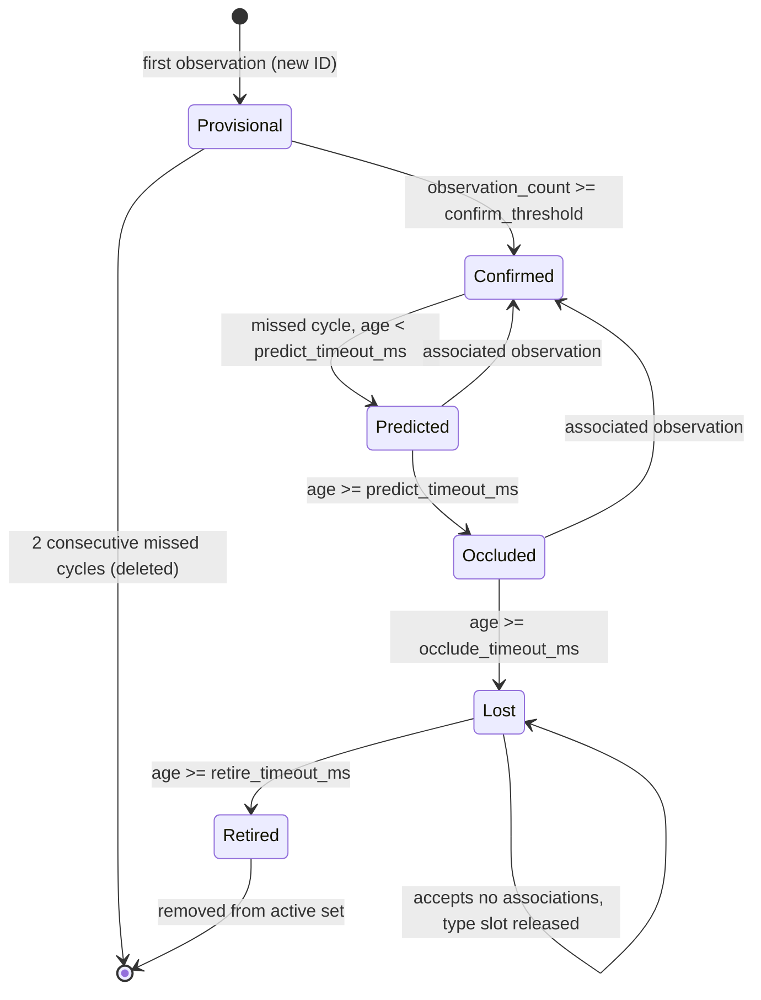

# v0.3 Vertical Slice — Track Lifecycle to Viewer - Plan

## Goal Capsule

- **Objective:** Complete the remaining v0.3 vertical slice of the tracking core: track lifecycle (TRK-014..016), floor-plane coordinate mapping (TRK-017..019), the `safe_for_control` predicate (TRK-020a/b/c), the v0.3 ZMQ snapshot publisher (TRK-021), full main-loop integration with clean shutdown, and the Python floor-frame viewer (VIEW-002/003).
- **Authority hierarchy:** Accepted ADRs (ADR-002, ADR-003, ADR-006, ADR-007, ADR-010) > this plan > ticket bodies. Where a ticket contradicts an ADR, the ADR wins — one known instance is resolved in KTD-8. Never cite ADR-009.
- **Execution profile:** Four phases, each sized for one autonomous `/goal` run and landed as one PR against `master` (same discipline as the detection + calibration cluster, PR #11). Every design fork is pre-decided in the Planning Contract; the executor should not reopen them. TRK-020a and TRK-020b may proceed in parallel inside Phase C; phases are strictly ordered.
- **Stop conditions:** Surface (do not self-resolve) anything that would change an ADR, relax a test to pass, alter the `safe_for_control` clause semantics, or actuate hardware. Camera capture on the Pi is permitted; nothing in this slice actuates the laser, drone, or servos.
- **Tail ownership:** Each phase ends with `tools/pi5-remote-test.sh` green on both build configs (zero warnings), then a PR. Never merge; never push beyond the phase branch without instruction. A failing Replay Gate is calibration signal — record counts and report, never tune thresholds.

---

## Product Contract

### Summary

Build the remaining v0.3 slice end to end: pixel-space track lifecycle over the existing ball detector, floor-plane coordinate mapping with ADR-010 Z compensation and uncertainty, the ADR-007 `safe_for_control` predicate with asymmetric hysteresis, a snapshot publisher on a dedicated export thread replacing today's placeholder JPEG stream, and a pygame viewer with clause-level safety visualisation. The laser detector (TRK-009x) stays excluded; laser-dependent code paths are proven with injected synthetic observations.

### Problem Frame

The pipeline currently ends at detection: `main.cpp` runs capture → quality gate → ball detector, then bridges into a stub `Tracker` and publishes JPEG frames over a placeholder ZMQ socket. Nothing downstream of detection exists — no track state, no world coordinates, no safety predicate, no structured stream, no floor-frame viewer. The v0.3 completion criteria (60 fps end-to-end on the Pi 5, well-formed v0.3 schema on ZMQ, zero false positives on `safe_for_control` across the replay scenarios, a viewer showing objects and safety state) all depend on this slice. The calibration artifacts this slice consumes (TRK-012/013 JSON) landed in the previous phase and are waiting for their first runtime consumer.

### Requirements

**Track lifecycle**

- R1. A `Track` carries the ADR-defined lifecycle: Provisional → Confirmed (after `track.confirm_threshold` observations) → Predicted → Occluded → Lost → Retired, driven by configurable timeouts, with monotonically increasing never-reused track IDs.
- R2. Observation association is strictly type-keyed: an observation of type T is only ever associated with a track of type T, nearest-within-gate (`gating.max_distance_px`), else it spawns a new Provisional track. Cross-type capture (a ball observation feeding the laser track) must be structurally impossible.
- R3. Re-entry policy: a Predicted or Occluded track returns to Confirmed on one associated observation. A Lost track accepts no associations and releases its per-type slot immediately on entering Lost; a new observation spawns a fresh Provisional track. A Provisional track that misses 2 consecutive cycles is deleted.
- R4. Lifecycle timers derive from capture timestamps (`steady_clock` ns); the tracker ticks every loop iteration regardless of frame admission, so REJECT bursts age tracks rather than freezing them. Prediction uses constant velocity, capped at `track.max_predict_duration_ms`, with uncertainty growing over prediction time.

**Coordinate mapping**

- R5. The extrinsics JSON is loaded and validated at startup: schema version, 3×3 shape, non-singularity (condition number below threshold), horizon safety — the projective denominator `w(u,v) = h₃₁u + h₃₂v + h₃₃` keeps a single sign and stays bounded away from zero across the stored anchors and the configured floor AOI corners (a determinant-sign check is NOT used: homographies are scale-ambiguous, so det sign is a fitting-convention artefact, not a geometric invariant — deviation from TRK-017's acceptance wording, corrected at execution) — self-consistency (the stored floor anchors mapped through the stored homography must reproduce the stored floor coordinates within the stored reprojection error), and artifact pairing (`camera_id` matches between intrinsics and extrinsics; when `undistorted_coordinates` is true, the extrinsics calibration timestamp postdates the intrinsics'). Any failure, including `undistorted_coordinates: false`, is a fatal startup error.
- R6. Ball positions are Z-compensated per ADR-010: the mapping accounts for the ball centroid sitting at `Z = ball.radius_m`, not on the floor plane. The residual bias on the ADR-010 worked-example geometry (camera 1 m high, 45° tilt, ball at 2 m) must be ≤ 5 mm, verified by unit test.
- R7. Every mapped position carries `uncertainty_m` propagated through the projection Jacobian from `coordinate.pixel_uncertainty_stddev_px`; far-from-camera observations carry larger uncertainty than near ones.
- R8. Degenerate mappings are rejected, not propagated: intersection behind the camera, near-horizon rays, or positions outside the configured floor area of interest cause the observation to be dropped (the track ticks unobserved). No NaN or infinity ever enters a snapshot; non-finite values invalidate the affected slot.

**Safety predicate**

- R9. `safe_for_control` implements ADR-007's eight clauses exactly, each failure appending its named reason, evaluated as a pure function of one `TrackingSnapshot`.
- R10. Hysteresis is asymmetric per ADR-007, with the conservative re-anchor rule (KTD-8): flip-to-false immediate; flip-to-true permitted only when all clauses pass AND at least `safe_for_control.min_unsafe_dwell_ms` has elapsed since the last failing evaluation. Initial state is unsafe with the dwell anchor set at the moment the tracker enters RUNNING, so the first flip-to-true always serves a full dwell.
- R11. Boundary semantics are uniform: the unsafe/decayed side wins ties (ages and speeds at exactly the threshold fail the clause; lifecycle timers at exactly the timeout decay).
- R12. An undefined input (no speed estimate yet, missing track) fails its clause — `false` on ambiguity per ADR-007.
- R13. `evaluate()` performs no heap allocation; reasons are carried as a fixed bitmask expanded to names only at serialisation.

**Publishing**

- R14. A `ZmqPublisher` on a dedicated export thread publishes the v0.3 JSON schema over PUB with `SNDHWM=1`, `CONFLATE=1`, `LINGER=0`, bound to `zmq.bind_address`, replacing the placeholder JPEG publish in `main.cpp`. Snapshots reach the export thread through an SPSC ring with freshest-wins overwrite; the hot path never blocks on the publisher.
- R15. Every message carries `schema_version: 1`, monotonic `message_id` (gaps are normal under conflation and documented), a per-run `session_id`, `publish_timestamp_ms` and `frame_capture_timestamp_ms` as wall-clock epoch ms, a `system_health` block with `tracker_state`, `calibration_status`, `ball_radius_m`, `cpu_temp_c`, and frame counters, and a `thresholds` block with the active clause thresholds (`age_max_ms`, `laser_settled_speed_m_per_s`, `alignment_tolerance_m`, `min_unsafe_dwell_ms`) so the viewer renders value-vs-threshold without a config side channel (static per session; the publisher embeds them from `Config` at construction — no snapshot growth). The message is a single-part JSON message with no topic envelope — libzmq's `ZMQ_CONFLATE` does not support multi-part messages, so cloning the current two-part JPEG framing would silently break the freshest-wins semantics; consumers subscribe with the empty filter.
- R16. Serialisation cost ≤ 0.5 ms per snapshot on the Pi 5; the JSON buffer is pre-sized at startup.
- R17. The schema contract documents a consumer staleness rule: consumers must treat any message older than 100 ms (local receive time) as stale and must not act on its `safe_for_control`. With the heartbeat deferred (TRK-022), this rule is the only staleness defence and is mandatory for any future controlling consumer.

**Viewer**

- R18. A pygame viewer subscribes (`RCVHWM=1`, `CONFLATE=1`), validates every message against pydantic models of the v0.3 schema, and renders the floor frame: grid, laser dot, ball circle at true scale, uncertainty rings, fading trails, prominent `safe_for_control` indicator, and system-health summary.
- R19. Connection states: CONNECTED, DISCONNECTED (socket-level, auto-reconnect), and STALLED when no message arrives for 1000 ms. Staleness is computed from local receive time plus in-message relative ages — never from cross-host wall-clock differences (the Pi has no NTP).
- R20. VIEW-003 adds the clause-by-clause breakdown (8 rows, value vs threshold), hysteresis countdown from `hysteresis_remaining_ms`, a 30-second safety timeline strip, and the alignment visualisation (tolerance circle around the ball). The timeline resets when `session_id` changes.
- R21. Schema violations are surfaced (counted and displayed), not silently discarded — the operator must never be blind to a misbehaving producer.

**Cross-cutting**

- R22. Hot-path discipline holds through the new stages: no per-frame heap allocation, no exceptions, no strings, no mutexes on the main loop; startup code may throw inside the existing pre-logger try block.
- R23. The process shuts down cleanly on SIGINT/SIGTERM: capture stop → main loop exit → export thread drain/stop → ZMQ close with `LINGER=0`.
- R24. All new config fields follow the existing validation idiom (required, dotted-path errors, finite-checks on every safety-feeding value) and land in the YAML template, `test_config.cpp`, and the semantic-validation block.

### Success Criteria

- Both build configs green on the Pi 5 via `tools/pi5-remote-test.sh` (zero warnings) at the end of every phase.
- End-to-end processing sustains ≥ 60 fps on the Pi 5 with the full pipeline live (measured over ≥ 30 s, logged rate).
- The safety Replay Gate shows zero `safe_for_control = true` frames across the recorded scenario library (see KTD-6 for what this does and does not prove; the current library is ~15 s total, so this is interim pipeline evidence — the ADR-007 ship gate's ≥3 scenarios / ≥5 min / ball-in-scene library is an open item, see Open Questions).
- The injected-observation suite drives the predicate to `true` at least once through the full production code path (the True-Positive Counterweight — "always false" cannot pass).
- The viewer renders live tracking from the Pi stream and correctly displays a forced unsafe→safe→unsafe sequence in replay.

### Scope Boundaries

**In scope:** everything in Requirements; synthetic-clip hermetic tests on the dev host; fixture calibration artifacts for tests; `requirements.txt` additions (`pygame`, `pydantic`).

**Deferred to follow-up work:**

- Laser detection (TRK-009a..d) — blocked pending modulated-laser recordings and the `real-hardware-actuation` skill. Until it lands, clauses 3/5/7/8 can only pass under injected observations, and "laser on tabletop" completion waits.
- Heartbeat thread (TRK-022) and full system-health reporting incl. thermal degradation (TRK-023) — the publisher carries the minimal `system_health` block only. The CLAUDE.md thermal contract (degrade above 80 °C within 1 s) is NOT implemented in this slice; it must land with TRK-023 before any consumer acts on the stream for control. `cpu_temp_c` is read (1 Hz, export thread) but drives nothing.
- Calibration health monitoring (TRK-024) — `calibration_status` is constant VALID after successful startup load; the marker detector stays unwired at runtime (its runtime consumer is TRK-024).
- ADR-003 ImagePixels degradation — v0.3 fails fast at startup on missing/invalid calibration instead of degrading; `coordinate_space` is always `Plane2D_World`.
- ADR-007 clause 9 (uncertainty margin) — v0.4 per the ADR; documented limitation.
- Ball plausibility gating (apparent-size vs mapped-position consistency) — a real anti-ghost measure surfaced in flow analysis, but it would add a predicate input beyond ADR-007's eight clauses; requires an ADR discussion first. Carried in Risks.
- Viewer promotion to top-level `viewer/` — stays at `tracking-core/src/viewer/` for v0.3.

---

## Planning Contract

### Key Technical Decisions

- KTD-1. **Thread topology: three threads, tracker on the main thread.** Capture thread (exists, SCHED_FIFO) → SPSC frame ring → main thread (quality, detect, track, map, predicate, snapshot build) → SPSC snapshot ring → new export thread (serialise, publish, temp read). No new real-time thread: avoids new affinity config and the known logging-mutex priority-inversion risk flagged in `logging.hpp`. The export thread clones the `CaptureThread` pattern (`Options` struct, `std::atomic<bool> stop_`, `start()/stop()` join, destructor safety net, relaxed counters, 1 Hz aggregated logging).
- KTD-2. **Snapshot queue: generalise the in-repo SPSC pattern, no new dependency.** Extract `FrameRingBuffer`'s CAS-reclaim freshest-wins logic into `template <typename T> SpscRing` for trivially-copyable T (enforced with the existing `static_assert(std::is_trivially_copyable_v<T>)` idiom). Freshest-wins overwrite matches ADR-002's `CONFLATE=1` semantics end to end. `FrameRingBuffer` itself is left untouched in this slice (re-basing it on the template is optional follow-up); the known TSan caveat on `try_pop` is inherited and carried in Risks.
- KTD-3. **`TrackingSnapshot` is trivially copyable with fixed slots.** One slot each for laser and ball (`valid` flag, object type, track ID/state, pixel and floor positions, velocity, `age_ms`, `speed_m_per_s`, `uncertainty_m`), a `SafetyResult` (bool, `uint16` reason bitmask, `hysteresis_remaining_ms`, `laser_ball_distance_m` — the clause-8 distance, finite only when both slots are valid, exposed so the viewer can render value-vs-threshold), frame/capture timestamps, and a small health struct. No vectors, no strings — reason names and JSON structure materialise only on the export thread.
- KTD-4. **Z compensation: recover the camera centre via plane-pose extraction, then closed-form height correction.** The extrinsics artifact stores only H (pixels → floor plane Z=0), so the ticket's sketch ("ray-plane intersect, then apply homography") is not implementable as written — H is only valid for Z=0 points. Note `cv::decomposeHomographyMat` does NOT apply here: it decomposes a homography *between two camera views* (model `K(R + t·nᵀ/d)K⁻¹`); ours maps pixels to a metric world plane. Use the standard plane-pose extraction instead: compute `B = K⁻¹ · H⁻¹` (H⁻¹ maps floor → pixels, so B ∝ [r₁ r₂ t]); normalise by `λ = 1/‖b₁‖`; set `r₁ = λb₁`, `r₂ = λb₂`, `r₃ = r₁ × r₂`; orthonormalise R via SVD; `t = λb₃`; choose the overall sign so the camera centre `C = −Rᵀt` has `C_z > 0`. Cache C at startup. At runtime, map the pixel through H to the Z=0 point X₀, then scale along the ray: `X_h = C + (C_z − h)/C_z · (X₀ − C)` for `h = expected_height(type)`. The solution is unique up to that one sign choice — no multi-branch ambiguity. Per-observation cost is a homography multiply plus a scale. Verified against ADR-010's worked-example geometry (R6).
- KTD-5. **Wire-format clocks: wall-clock epoch ms via per-message offset sampling.** Capture stays `steady_clock` ns internally. At each publish, sample both clocks once and derive `publish_timestamp_ms` and `frame_capture_timestamp_ms` from the same steady→wall offset. Consumers never compare producer wall-clock to their own for staleness (R17/R19) — the fields exist for logging and ordering, not cross-host freshness.
- KTD-6. **Laser verification strategy: injection through the production path; the replay gate is vacuous by design and says so.** Synthetic laser observations are injected at the Observation-build stage and flow through the identical gating/lifecycle/mapping/predicate code — never spliced directly into tracks or snapshots. In tests, both injected observations and the tracker/evaluator `now_ns` come from a synthetic frame-derived clock (capture timestamp + fixed step) so replay outcomes depend only on clip content, not test-host scheduling — the age clauses (50 ms) and the dwell (200 ms) would otherwise flake under load; production passes `steady_clock` through the same parameters. On real footage (no laser detector) clause 3 always fails, so the Replay Gate's zero-false-positive assertion is vacuously satisfied; the gate still proves the pipeline never fabricates a laser track from real footage, and the injected suite provides the True-Positive Counterweight. Full ADR-007 replay validation on real laser footage is deliverable only with TRK-009x — the plan claims pipeline-correctness evidence, not physical-scenario evidence.
- KTD-7. **Calibration consumption: fail-fast, then constant VALID.** Both artifacts (`calibration.intrinsics_path`, `calibration.extrinsics_path`) load and validate at startup inside the existing try block; any failure exits with a precise error. The loader runs the self-consistency and pairing checks from R5 and requires `undistorted_coordinates: true` — a distorted-fit homography contaminates the KTD-4 camera-centre recovery and can regionally exceed the R6 5 mm and clause-8 2 cm budgets while `calibration_status` reads VALID, so a `false` artifact is a fatal startup error telling the operator to re-run `calibrate_extrinsics.py --intrinsics` (cheap; the tool already supports it). Accepting distorted-fit artifacts is the ADR-003 degradation path's future business, not v0.3's.
- KTD-8. **Hysteresis semantics: re-anchor on every failing evaluation (the conservative reading).** ADR-007's letter ("must remain false for at least MIN_UNSAFE_DWELL_MS before being permitted to flip back") and TRK-020c's acceptance ("all clauses passing for at least MIN_UNSAFE_DWELL_MS continuous cycles") differ: under a literal anchor-only-on-flip formula, clauses alternating pass/fail at frame rate would produce a one-frame `safe=true` window every dwell period — exactly the chatter the hysteresis exists to prevent. Implement the conservative semantics: while unsafe, **any evaluation with a failing clause re-anchors the dwell**; `safe := all_pass && (now − anchor) ≥ min_unsafe_dwell_ms` where `anchor` is the most recent failing evaluation (initially RUNNING entry, per R10). This satisfies ADR-007's minimum-dwell condition (it only ever holds false longer), implements the ticket's continuous-pass acceptance, and only adds false negatives — the accepted cost direction. The user approved this reading and ADR-007's hysteresis section carries the clarification (dated 2026-07-18); at execution time, note the resolution in the TRK-020c ticket log.
- KTD-9. **Association hygiene: type-keyed gates, slot release at Lost.** R2/R3 close the two false-SAFE association paths found in flow analysis (cross-type capture at the laser-on-ball moment; a fast-moving ball locked out by its own Lost track for up to a second). Association-jump statistics (count of associations > half the gate radius) are recorded as informational `RecordProperty` output in replay tests to watch the R-04 reflection-ghost risk.
- KTD-10. **Viewer: pygame, in place, argparse-configured.** pygame over matplotlib for a real-time render loop. The viewer stays at `tracking-core/src/viewer/` (promotion deferred); the existing JPEG `viewer.py` is replaced — it is already broken against current config (connects to port 5556; core binds 5555) and its transport disappears with the JPEG publisher. Configuration via argparse flags (`--endpoint`, `--floor-scale`, `--trail-length`, `--stale-ms`) with defaults matching R19; no viewer YAML.

### High-Level Technical Design

Pipeline topology (threads, queues, and the seam each phase fills):

Track lifecycle state machine (R1–R4; every edge is a unit-test case):

`safe_for_control` evaluation and hysteresis (R9–R12; dwell anchored per KTD-8):

```mermaid
stateDiagram-v2
  [*] --> Unsafe : RUNNING entry (anchor = now)
  Unsafe --> Unsafe : any clause fails (anchor = now, re-anchor every fail)
  Unsafe --> Safe : all 8 clauses pass AND now − anchor >= min_unsafe_dwell_ms
  Safe --> Unsafe : any clause fails (immediate, anchor = now)
  Safe --> Safe : all clauses pass
```

### Sequencing

Phases are dependency-ordered and each is one `/goal` run ending in a Pi-green PR: **A** track lifecycle (U1–U4) → **B** coordinates (U5–U7) → **C** safety (U8–U12) → **D** export + viewer (U13–U17). Within C, U9 and U10 are parallel-safe (disjoint clause groups); everything else is serial within its phase.

---

## Implementation Units

Unit index:

| U-ID | Title | Key files | Depends on |
|---|---|---|---|
| U1 | Observation type, Track class, lifecycle state machine | `src/core/include/track.hpp`, `src/core/tracking/track.cpp` | — |
| U2 | Tracker: type-keyed gating and association | `src/core/include/tracker.hpp`, `src/core/tracking/tracker.cpp` | U1 |
| U3 | Constant-velocity prediction | `src/core/tracking/track.cpp` | U1, U2 |
| U4 | Main-loop tracker integration + clean shutdown | `src/core/main.cpp`, `src/core/include/tracking_pipeline.hpp` | U2, U3 |
| U5 | HomographyLoader + calibration artifact validation | `src/core/include/homography_loader.hpp`, `src/core/coordinate/homography_loader.cpp` | — |
| U6 | CoordinateMapper: Z compensation | `src/core/include/coordinate_mapper.hpp`, `src/core/coordinate/coordinate_mapper.cpp` | U5 |
| U7 | Uncertainty propagation | `src/core/coordinate/coordinate_mapper.cpp` | U6 |
| U8 | TrackingSnapshot + SnapshotBuilder | `src/core/include/tracking_snapshot.hpp`, `src/core/tracking/snapshot_builder.cpp` | U4, U7 |
| U9 | Predicate system/track clauses (1–4) | `src/core/safety/safe_for_control.cpp` | U8 |
| U10 | Predicate temporal/geometric clauses (5–8) | `src/core/safety/safe_for_control.cpp` | U8 |
| U11 | Hysteresis + full evaluator + loop integration | `src/core/safety/safe_for_control.cpp`, `src/core/main.cpp` | U9, U10 |
| U12 | Injection harness + synchronous safety replay gate | `tests/cpp_unit/test_safety_replay.cpp` | U11 |
| U13 | SpscRing template + ExportThread skeleton | `src/core/include/spsc_ring.hpp`, `src/core/export/export_thread.cpp` | U8 |
| U14 | ZmqPublisher + v0.3 schema + main.cpp cutover | `src/core/export/zmq_publisher.cpp`, `src/core/main.cpp` | U11, U13 |
| U15 | VIEW-002 pygame viewer | `src/viewer/viewer.py`, `src/viewer/schema.py` | U14 |
| U16 | VIEW-003 safety visualisation | `src/viewer/safety_panel.py` | U15 |
| U17 | End-to-end Pi verification: 60 fps + gates | `tests/cpp_unit/`, `tools/` | U14, U16 |

All paths are relative to `tracking-core/`, with one exception: `tools/pi5-remote-test.sh` lives at the repository root (`Drone/tools/`), not `tracking-core/tools/`. Every C++ unit adds its test file to the `tracking_core_tests` source list in `tests/cpp_unit/CMakeLists.txt` and its sources to `tracking_core_lib` in `src/core/CMakeLists.txt`.

### Phase A — Track lifecycle (goal run 1)

### U1. Observation type, Track class, lifecycle state machine

- **Goal:** The generic `Observation` type and a `Track` class implementing R1/R3/R4's state machine.
- **Requirements:** R1, R3, R4 (timers), R11 (tie-break), R22.
- **Files:** create `src/core/include/track.hpp`, `src/core/tracking/track.cpp`, `tests/cpp_unit/test_track.cpp`; modify `src/core/include/config.hpp`, `src/core/config.cpp`, `config/tracking_core.yaml`, `tests/cpp_unit/test_config.cpp`.
- **Approach:** `Observation { ObjectType type; cv::Point2f centroid_px; double radius_px; std::int64_t capture_timestamp_ns; }`. `TrackState` enum with the six states; `Track::tick(bool observed, std::int64_t now_ns)` drives every transition; observation feed is a separate `Track::observe(const Observation&)`. Ages compare against capture timestamps; ties decay (R11: `>=` decays, `<` passes — state this once in a header comment and reference it from every comparison). Monotonic ID from an atomic counter. New config section `track` (`confirm_threshold` 3, `predict_timeout_ms` 50, `occlude_timeout_ms` 200, `retire_timeout_ms` 1000, `max_predict_duration_ms` 100) following the `require<T>` + semantic-block idiom; timeouts must be strictly increasing (validated).
- **Patterns to follow:** config idiom in `src/core/config.cpp`; file-header `// TRK-014:` provenance comments; `trailing_underscore_` members; k-constants.
- **Test scenarios:** every valid transition (one test each); every invalid transition asserts no state change; boundary values at each timeout (exactly-at decays, one-ns-under holds); Provisional deleted after exactly 2 missed cycles; Predicted/Occluded → Confirmed on one observation; Lost accepts no observation; IDs strictly increase and never reuse across retire/create cycles; parallel tracks age independently.
- **Verification:** `ctest` green both configs locally; config template smoke test passes with the new section.

### U2. Tracker: type-keyed gating and association

- **Goal:** Replace the stub `Tracker` with real gating/association over `Observation`s.
- **Requirements:** R2, R3 (slot release), R4 (tick every iteration), R22.
- **Files:** create `src/core/include/tracker.hpp`, `tests/cpp_unit/test_tracker.cpp`; rewrite `src/core/tracking/tracker.cpp`; modify `src/core/include/tracking_pipeline.hpp` (remove stub), config files (new `gating` section: `max_distance_px` 50); delete `tests/cpp_unit/test_tracking_pipeline.cpp` and drop it from `tests/cpp_unit/CMakeLists.txt` — it exercises the stub's `cv::Rect` API and breaks the build the moment the stub goes; `test_tracker.cpp` supersedes its coverage.
- **Approach:** `Tracker::update(span-of-observations, now_ns) -> const std::vector<Track>&` (internal storage pre-reserved; returned by const ref, no per-frame allocation). Association per type: nearest active non-Lost track of the same type within the gate; else new Provisional (subject to slot availability). Per-type slots: 1 laser, 1 ball (markers not tracked at runtime in v0.3). Lost entry releases the slot; Retired removal compacts the active set. Unobserved tracks get `tick(false, now)`.
- **Patterns to follow:** pre-allocation idiom from `BallDetector` (reserve at construction).
- **Test scenarios:** observation near existing track associates; far spawns Provisional; two same-type observations — nearest wins, other spawns only if slot free; ball observation never associates to a laser track even when nearest (R2 — the false-SAFE path); track unobserved for a cycle ages; Lost track ignored by association and a new Provisional spawns immediately (R3 — no 1 s lockout); Retired tracks removed.
- **Verification:** unit suite green; stub references gone (`tracking_pipeline.hpp` compiles without the old bridge).

### U3. Constant-velocity prediction

- **Goal:** Position extrapolation for unobserved tracks with growing uncertainty (TRK-016).
- **Requirements:** R4.
- **Files:** modify `src/core/tracking/track.cpp`, `src/core/include/track.hpp`, `tests/cpp_unit/test_track.cpp`.
- **Approach:** pixel-space velocity from the last two observations (`dt` guard: `dt <= 0` retains previous velocity and skips the update); prediction only in Predicted/Occluded states, capped at `max_predict_duration_ms`, after which position freezes and the state machine handles decay. Pixel-space positional uncertainty grows linearly with prediction time (faster when velocity is unknown).
- **Test scenarios:** linear motion predicted within tolerance; stationary track stays put; uncertainty monotonically grows during prediction; prediction stops at the cap; fewer than 2 observations → no velocity, faster uncertainty growth; duplicate timestamps don't produce NaN velocity.
- **Verification:** unit suite green both configs.

### U4. Main-loop tracker integration + clean shutdown

- **Goal:** Wire the real tracker into `main.cpp` and give the process a shutdown path.
- **Requirements:** R4, R22, R23.
- **Files:** modify `src/core/main.cpp`, `src/core/include/tracking_pipeline.hpp`; create `tests/cpp_unit/test_pipeline_tracking.cpp`.
- **Approach:** Build `Observation` from `BallObservation` + `FrameMetadata.capture_timestamp_ns` (this build point is the injection seam of KTD-6 — keep it a small named function). Tracker ticks every loop iteration with `steady_clock::now()` even when `try_pop` yields nothing or quality REJECTs (R4). Replace `while (true)` with a `std::atomic<bool>`-checked loop driven by a signal handler (SIGINT/SIGTERM; handler only sets the flag — async-signal-safe); shutdown order per R23. The JPEG publish stays as-is in this phase (removed in U14).
- **Execution note:** smoke-verify shutdown on the Pi (Ctrl-C exits cleanly, joins both threads, exit code 0) in addition to unit coverage.
- **Test scenarios:** synthetic-clip test (in-test `cv::VideoWriter`, the `test_replay_source.cpp` idiom): a moving composited ball (occlusion-modelled per the composite-targets solution doc) is Confirmed within `confirm_threshold` frames; ball disappears mid-clip → track decays Predicted → Occluded → Lost on schedule; REJECT-quality burst ages the track rather than freezing it.
- **Verification:** Phase A gate — `tools/pi5-remote-test.sh` green both configs, zero warnings; clean-shutdown smoke on the Pi; PR opened.

### Phase B — Coordinate mapping (goal run 2)

### U5. HomographyLoader + calibration artifact validation

- **Goal:** Load and validate both calibration artifacts at startup; fatal on any defect (TRK-017).
- **Requirements:** R5, R24.
- **Files:** create `src/core/include/homography_loader.hpp`, `src/core/coordinate/homography_loader.cpp`, `tests/cpp_unit/test_homography_loader.cpp`.
- **Approach:** nlohmann/json parse of the TRK-013 extrinsics JSON (`homography_3x3`, `floor_anchor_points`, `undistorted_coordinates`, `reprojection_error_m`, schema version) and TRK-012 intrinsics JSON. Validation per R5: version == 1; condition number < `coordinate.condition_number_max` (default 1000); projective-denominator single-sign/bounded-away-from-zero over anchors + AOI corners; self-consistency — each stored anchor's image point through H reproduces its stored floor coordinates within `max(reprojection_error_m, 1 mm)` (the artifact carries its own evidence; do not trust flags); pairing — `camera_id` match and, for the timestamp ordering, the calibration timestamps both artifacts carry (verify exact field names in the tools at execution; if a field is genuinely absent, add it to the producing tool in this unit rather than skipping the check); `undistorted_coordinates` must be true (KTD-7). Returns `HomographyData { cv::Matx33d H; std::vector<FloorAnchor> anchors; double reprojection_error_m; }`. Throws with a precise message (startup context only).
- **Patterns to follow:** the artifact-contract learning (`docs/solutions/python/2026-07-18-artifact-metadata-derived-not-asserted.md`); startup error idiom in `main.cpp`.
- **Test scenarios:** valid fixture JSON loads; missing file / malformed JSON / wrong version / near-singular condition number / denominator sign flip or near-zero inside the AOI each throw with distinct messages; self-consistency violation (anchors deliberately inconsistent with H) throws — this is the contract test the previous phase's P1 taught us to write; `undistorted_coordinates: false` throws with the re-run-with-`--intrinsics` message; mismatched `camera_id` throws; extrinsics timestamp older than intrinsics throws. Fixtures are written in-test to `::testing::TempDir()` (the `test_config.cpp` temp-YAML idiom) with values from a known synthetic geometry.
- **Verification:** unit suite green; loader wired into startup in U6.

### U6. CoordinateMapper: Z compensation

- **Goal:** Pixel → FloorPlane2D projection with object-class Z compensation (TRK-018, ADR-010) via KTD-4.
- **Requirements:** R6, R8, R24.
- **Files:** create `src/core/include/coordinate_mapper.hpp`, `src/core/coordinate/coordinate_mapper.cpp`, `tests/cpp_unit/test_coordinate_mapper.cpp`; modify config files (new `coordinate` section: `pixel_uncertainty_stddev_px` 1.0, `condition_number_max` 1000, `floor_aoi_x_min/max_m`, `floor_aoi_y_min/max_m` — AOI defaults provisional, marked in the template) and `src/core/main.cpp` (startup construction).
- **Approach:** At construction: load intrinsics, precompute the undistort maps/inverse intrinsics, run the KTD-4 plane-pose extraction (`B = K⁻¹H⁻¹`, orthonormalise, sign chosen so `C_z > 0`), cache camera centre C. Per observation: undistort (the artifact is guaranteed undistorted-fit per KTD-7), map through H to X₀, closed-form scale to `Z = expected_height(type)` (laser 0, ball `ball.radius_m`, marker 0). Validity predicate (R8): reject when the height correction denominator `C_z − h` ≤ ε, when the scale factor is non-positive (behind-camera geometry), or when the result leaves the floor AOI; rejected observations are dropped before the tracker. Returns `FloorPosition { double x_m, y_m, z_m, uncertainty_m; bool valid; }`. No heap allocation after construction.
- **Technical design (directional):** `X_h = C + (C_z − h)/C_z · (X₀ − C)` — the Z=0 homography point scaled along the camera ray; equivalent to ray-plane intersection but requires only H, K, and C.
- **Test scenarios:** ADR-010 worked example (camera 1 m, 45° tilt, ball at 2 m, radius 3 cm): naive H-only projection shows ~3 cm bias, compensated projection ≤ 5 mm (R6); laser at Z=0 is identical with and without compensation; degenerate cases (h ≥ C_z, out-of-AOI, far-horizon pixel) all return `valid=false`, never NaN; the plane-pose extraction recovers the fixture's known camera centre within tolerance and the sign choice yields `C_z > 0` (a sign or orthonormalisation slip must fail this test, not surface later as bias).
- **Verification:** unit suite green; the ADR-010 bias test is the phase's headline evidence.

### U7. Uncertainty propagation

- **Goal:** `uncertainty_m` from the projection Jacobian (TRK-019).
- **Requirements:** R7.
- **Files:** modify `src/core/coordinate/coordinate_mapper.cpp`, `tests/cpp_unit/test_coordinate_mapper.cpp`.
- **Approach:** 2×2 Jacobian of the composed mapping (undistort → H → height scale) w.r.t. pixel coordinates, computed analytically from the cached matrices (numerical differentiation acceptable as a cross-check in tests, not in production); `uncertainty_m = ‖J‖₂ × pixel_uncertainty_stddev_px`. Document the norm choice (spectral) in the header.
- **Test scenarios:** near vs far observation — far strictly larger; steep vs shallow fixture tilt — shallow larger; known-geometry case matches a hand-computed value within 10 %; uncertainty is finite and positive everywhere in the AOI.
- **Verification:** Phase B gate — `tools/pi5-remote-test.sh` green both configs; PR opened.

### Phase C — Safety predicate (goal run 3)

### U8. TrackingSnapshot + SnapshotBuilder

- **Goal:** The trivially-copyable snapshot (KTD-3) and the builder that fills it each frame.
- **Requirements:** R8 (sanitisation), R12 (undefined speed), R13, R22.
- **Files:** create `src/core/include/tracking_snapshot.hpp`, `src/core/tracking/snapshot_builder.cpp`, `tests/cpp_unit/test_snapshot_builder.cpp`; modify `src/core/main.cpp`.
- **Approach:** `TrackingSnapshot` per KTD-3 with `static_assert(std::is_trivially_copyable_v<TrackingSnapshot>)` and a size assert (≤ 512 bytes). Builder holds per-type last observed floor position + capture timestamp; `speed_m_per_s` from consecutive observation-backed floor positions only (predicted positions never feed speed); `dt <= 0` retains the previous speed and marks the sample unusable; speed is undefined until two observations exist. Every float finite-checked; any non-finite invalidates that slot (`valid=false`) and increments a counter. `tracker_state` transitions INITIALISING → RUNNING on the first quality-admitted frame; `calibration_status` constant VALID (KTD-7).
- **Test scenarios:** two observations → correct speed; duplicate timestamp → previous speed retained; predicted-position frames do not update speed; NaN floor position → slot invalid, no NaN anywhere in the snapshot; INITIALISING→RUNNING fires exactly once on the first admitted frame; snapshot is trivially copyable (compile-time).
- **Verification:** unit suite green both configs.

### U9. Predicate system/track clauses (1–4)

- **Goal:** Clauses 1–4 of ADR-007 (TRK-020a).
- **Requirements:** R9, R12, R13.
- **Files:** create `src/core/include/safe_for_control.hpp`, `src/core/safety/safe_for_control.cpp`, `tests/cpp_unit/test_safe_for_control.cpp`.
- **Approach:** `UnsafeReason` enum backing a `uint16` bitmask (`TrackerNotRunning`, `CalibrationInvalid`, `LaserNotConfirmed`, `BallNotConfirmed`, `AgeExceedsThreshold`, `LaserInTransit`, `LaserBallMisaligned`; one spare bit reserved for the v0.4 clause 9). `evaluate_system_clauses(snapshot) -> uint16`. Missing/invalid slot fails its clause (R12).
- **Test scenarios:** for each clause, a snapshot where only that clause fails yields exactly that reason bit; INITIALISING fails clause 1; invalid laser slot fails clause 3; all-pass yields zero mask.
- **Verification:** unit suite green. Parallel-safe with U10.

### U10. Predicate temporal/geometric clauses (5–8)

- **Goal:** Clauses 5–8 of ADR-007 (TRK-020b).
- **Requirements:** R9, R11, R12, R13; config gains `safe_for_control.min_unsafe_dwell_ms` (200) in this phase (used by U11).
- **Files:** modify `src/core/safety/safe_for_control.cpp`, `tests/cpp_unit/test_safe_for_control.cpp`, config files.
- **Approach:** ages from snapshot `age_ms` fields; clause 8 distance in FloorPlane2D between Z-compensated positions; boundary rule R11 (`>=` threshold fails). Undefined speed (fewer than two observations) fails clause 7 (R12).
- **Test scenarios:** each clause at boundary — exactly-at fails, just-under passes (ages 50 ms, speed 0.05 m/s, distance radius+0.02 m); undefined speed fails clause 7; combined failures accumulate all applicable reason bits.
- **Verification:** unit suite green. Parallel-safe with U9.

### U11. Hysteresis + full evaluator + loop integration

- **Goal:** ADR-007 hysteresis (KTD-8), the combined `evaluate()`, and per-frame wiring (TRK-020c).
- **Requirements:** R9, R10, R13.
- **Files:** modify `src/core/safety/safe_for_control.cpp`, `src/core/main.cpp`, `tests/cpp_unit/test_safe_for_control.cpp`.
- **Approach:** state = `{ last_fail_anchor_ns, currently_safe }`, initialised unsafe with the anchor at RUNNING entry (R10 — kills the startup false-positive found in flow analysis). Per KTD-8, every evaluation with any failing clause sets the anchor to now (whether or not a flip occurred); `evaluate()` composes both clause groups, applies the dwell (`>=` passes the dwell per its own direction: dwell served at exactly `min_unsafe_dwell_ms`), computes `hysteresis_remaining_ms = max(0, dwell − (now − anchor))`, and never allocates. Called once per frame after snapshot build; result (including `laser_ball_distance_m` from clause 8) stored into the snapshot.
- **Test scenarios:** first-ever all-pass evaluation within the dwell stays false; all-pass after a served dwell flips true; chatter (alternating pass/fail) never flips true; flip-to-false is same-evaluation immediate; a mid-dwell clause failure re-anchors the dwell; `hysteresis_remaining_ms` counts down to zero and reports zero when safe; dwell boundary — exactly-at flips true.
- **Verification:** unit suite green both configs.

### U12. Injection harness + synchronous safety replay gate

- **Goal:** Prove the predicate both ways: never true on real footage, reachable true through the production path (KTD-6).
- **Requirements:** R9, R10; success criteria 3 and 4.
- **Files:** create `tests/cpp_unit/test_safety_replay.cpp`; modify `tests/cpp_unit/CMakeLists.txt`.
- **Approach:** A synchronous full-pipeline harness: construct quality gate, detector, tracker, mapper, builder, evaluator directly and feed frames in order from `ReplaySource` — no capture thread, no ring. Determinism requires a synthetic time base (KTD-6): `now_ns` and injected-observation timestamps derive from the frame sequence (capture timestamp + fixed step), passed through the same `tick()`/`evaluate()` clock parameters production uses — real `steady_clock` timing would make the 50 ms age clauses and 200 ms dwell functions of test-host load, flaking the gate and inviting the threshold-tuning the house rules forbid. Injection helper produces laser (and optionally ball) `Observation`s at the U4 seam. Fixture calibration artifacts as in U5. Duration honesty: the current Pi library is three 5 s clips (~15 s total) — the gate over it is interim pipeline evidence; the ADR-007 ship gate proper needs ≥3 scenarios totalling ≥5 min (see Open Questions).
- **Test scenarios:** (a) Replay Gate: over each of the three Pi clips (`TRACKING_REPLAY_DIR`-gated, `GTEST_SKIP` off-Pi), zero frames with `safe_for_control == true`, `EXPECT_EQ(unsafe_true_count, 0) << counts` style; informational `RecordProperty` for clause-failure histogram and association-jump count (KTD-9). (b) True-Positive Counterweight: injected laser+ball sequences on a synthetic clip drive every clause to pass and the predicate flips true after the dwell — through `Tracker::update`, not by hand-built snapshots; then a misalignment beyond radius+tolerance flips it false immediately. (c) Injected sequences for each laser clause: stale laser (age), moving laser (speed), misaligned laser (distance) each hold the predicate false with the right reason.
- **Execution note:** if the on-Pi Replay Gate fails, record the counts and report per the house rule — never adjust thresholds or the dwell to pass.
- **Verification:** Phase C gate — `tools/pi5-remote-test.sh` green both configs including the replay tests on-Pi; PR opened.

### Phase D — Export and viewer (goal run 4)

### U13. SpscRing template + ExportThread skeleton

- **Goal:** The generalised SPSC ring (KTD-2) and the export thread shell (KTD-1).
- **Requirements:** R14 (queue semantics), R22, R23.
- **Files:** create `src/core/include/spsc_ring.hpp`, `src/core/include/export_thread.hpp`, `src/core/export/export_thread.cpp`, `tests/cpp_unit/test_spsc_ring.cpp`.
- **Approach:** `SpscRing<T>` extracted from `FrameRingBuffer`'s algorithm (CAS tail-reclaim on full, torn-copy discard on failed consumer CAS, pre-allocated slots, `static_assert` trivially-copyable). `ExportThread` clones the `CaptureThread` lifecycle pattern; consumes the ring at ~publish rate (poll + 1 ms sleep on empty, matching the main loop idiom); drains outstanding snapshot on stop before joining (R23).
- **Test scenarios:** single-producer single-consumer ordering; overwrite-when-full keeps the freshest item; concurrent hammer test (producer thread + consumer thread, N=10⁶) never yields a torn or duplicated item; start/stop/destructor join semantics; stop with an undrained item publishes it before exit.
- **Verification:** unit suite green both configs (the hammer test runs in Release too).

### U14. ZmqPublisher + v0.3 schema + main.cpp cutover

- **Goal:** The real v0.3 stream replaces the placeholder JPEG publisher (TRK-021).
- **Requirements:** R14–R17, R23, R24.
- **Files:** create `src/core/include/zmq_publisher.hpp`, `src/core/export/zmq_publisher.cpp`, `tests/cpp_unit/test_zmq_publisher.cpp`; modify `src/core/main.cpp` (remove JPEG publish + `imencode`; construct ring/export thread/publisher), `src/core/CMakeLists.txt` (keep zmq types out of public headers so cppzmq stays PRIVATE).
- **Approach:** Constructor: context, PUB socket, `SNDHWM=1 CONFLATE=1 LINGER=0`, bind `zmq.bind_address` (throwing startup context). `publish(const TrackingSnapshot&)` on the export thread: expand the bitmask to reason strings, apply KTD-5 clock mapping (per-message offset sample), serialise with nlohmann/json into a buffer `reserve`d at startup (measure worst-case once, assert under 0.5 ms in a test on the Pi), send. `message_id` monotonic from zero; `session_id` = wall-clock epoch ms at startup. `system_health`: `tracker_state`, `calibration_status`, `ball_radius_m`, `cpu_temp_c` (sysfs read at 1 Hz on the export thread, `-1.0` off-Linux), `frames_processed_count`, `frames_rejected_count`, `frame_drop_rate`; `thresholds` block per R15, embedded from `Config` at construction. Single-part message, no topic frame (R15 — `ZMQ_CONFLATE` is incompatible with multipart; the old `"frames"` topic framing must not be cloned). The schema (field names, staleness rule R17, conflation-gap note, single-part rule) is documented in a fenced block in `zmq_publisher.hpp`'s header comment — the single C++-side source of truth, mirrored by the U15 pydantic models.
- **Test scenarios:** serialise a known snapshot → parse back and check every field including reason names, the `thresholds` block, `laser_ball_distance_m`, and `coordinate_space: "Plane2D_World"`; received message has exactly one ZMQ part; invalid slots omitted from `objects` (empty array when nothing tracked); monotonic `message_id`; socket options verified via `getsockopt`; NaN injected into a snapshot never reaches JSON (slot invalidated upstream, U8 — here assert serialiser rejects non-finite defensively); round-trip with a Python test subscriber (`tests/python_integration/test_zmq_schema.py`) validating against the pydantic models.
- **Verification:** on-Pi serialisation ≤ 0.5 ms; both configs green; old JPEG path fully gone.

### U15. VIEW-002 pygame viewer

- **Goal:** The floor-frame viewer over the real stream.
- **Requirements:** R18, R19, R21.
- **Files:** replace `src/viewer/viewer.py`; create `src/viewer/schema.py` (pydantic models), `src/viewer/renderer.py`, `tests/python_integration/test_viewer_schema.py`; modify `requirements.txt` (add `pygame`, `pydantic>=2`), delete `src/viewer/utils.py` + its test (JPEG transport is gone).
- **Approach:** SUB socket per R18, empty subscription filter (single-part messages, R15); non-blocking poll with timeout; every message through the pydantic models (mirroring the U14 schema doc); metres→pixels transform with `--floor-scale`. Fixed screen layout shared with U16 so the two units target the same frame: the floor-plane render fills the main/left area at full height; a fixed-width right sidebar stacks the `safe_for_control` indicator (top, largest element), then the U16 clause panel, then the health summary; the 30 s timeline strip (U16) runs full-width along the bottom; spatial overlays (alignment circle, trails) render inside the floor view. Connection states per R19 (`--stale-ms` default 1000). On a schema-validation failure the message is discarded for rendering, the violation counter increments, and the last-valid render takes the STALLED visual treatment (desaturated indicator and objects) — an unmarked stale SAFE indicator during a violation run is exactly the blindness R21 forbids; reuse the STALLED visuals rather than inventing a fourth state. Trails clear on `session_id` change and on DISCONNECTED→CONNECTED (track IDs are only unique within one core process). Type hints, black + ruff clean, no framework.
- **Patterns to follow:** `.claude/rules/python.md` (pydantic mandated for ZMQ consumers); calibration tools' argparse style.
- **Test scenarios:** pydantic models accept a golden message and reject: missing `coordinate_space`, non-finite floats, unknown `schema_version`, wrong types; staleness state machine transitions on a mocked clock; renderer coordinate transform round-trips known points; mock-publisher integration test streams valid + invalid messages and asserts the violation counter increments without a crash.
- **Verification:** `pytest tests/python_integration/` green; manual smoke against the Pi stream.

### U16. VIEW-003 safety visualisation

- **Goal:** Clause-level observability of the predicate.
- **Requirements:** R20.
- **Files:** create `src/viewer/safety_panel.py`; modify `src/viewer/viewer.py`, `tests/python_integration/test_viewer_schema.py`.
- **Approach:** 8-row clause panel in the U15 sidebar, driven by `unsafe_reasons` plus current values vs thresholds — ages and speed from the object slots, clause-8 distance from `laser_ball_distance_m`, thresholds from the message's `thresholds` block (all on the wire per R15/KTD-3; no config side channel); hysteresis countdown from `hysteresis_remaining_ms`; 30 s ring-buffer timeline strip along the bottom edge; alignment circle `ball.radius_m + alignment_tolerance_m` rendered inside the floor view with the laser's relative position; timeline resets on `session_id` change.
- **Test scenarios:** each reason maps to the right row highlight; countdown displays and reaches zero; timeline colours match a scripted safe/unsafe sequence; `session_id` change clears the timeline; alignment circle radius matches config values from the stream.
- **Verification:** integration test green; manual replay demo shows a forced unsafe→safe→unsafe sequence (success criterion 5).

### U17. End-to-end Pi verification: 60 fps + gates

- **Goal:** The slice's completion evidence on target.
- **Requirements:** Success criteria 1–5; R16.
- **Files:** possibly `tools/pi5-remote-test.sh` (only if the replay-gate env wiring needs extension); no production code — this unit is measurement and fixing what it finds.
- **Approach:** Run the full pipeline on the Pi 5 (live camera and looped replay clips) for ≥ 30 s; the 1 Hz aggregated log reports processing rate — assert ≥ 60 fps sustained; run the complete on-Pi suite both configs; viewer connected from the dev host over the LAN for the live demo. **Precondition (user-performed, physical):** per-deployment calibration artifacts must exist at the configured paths — no `intrinsics.json`/`extrinsics.json` is in the repo, and after Phase B the core fails fast without them. The operator runs the TRK-012/013 tools against the mounted Pi camera (pattern capture + hand-measured floor anchors, with `--intrinsics` so the artifact is undistorted-fit) immediately before this unit; success criteria 2 and 5 depend on it, and the replay-clip portions proceed without it. If the ship-gate recordings and their hand-measured ball ground truth exist by this point (Open Questions), also run the end-to-end accuracy check: mapped ball position vs hand-measured position within the 2 cm clause-8 envelope. Fix regressions found; do not tune gates.
- **Execution note:** this is deliberately smoke/runtime verification — the formal latency/CPU/RSS budget suite is TRK-026, out of slice.
- **Test scenarios:** none new — this unit executes the Verification Contract.
- **Verification:** Phase D gate — everything in the Verification Contract green; PR opened.

---

## Verification Contract

| Gate | Command | Applies |
|---|---|---|
| Dev build + unit tests | `cmake -S . -B build && cmake --build build && (cd build && ctest --output-on-failure)` from `tracking-core/` | every unit |
| Python tests | `pytest tests/python_integration/` from `tracking-core/` (`.venv`) | U5 fixtures, U14 round-trip, U15/U16 |
| On-target gate | `tools/pi5-remote-test.sh` — both configs, zero warnings, SCHED_FIFO path, replay tests when `TRACKING_REPLAY_DIR` clips exist | every phase end |
| Safety Replay Gate | `test_safety_replay.cpp` on-Pi over `normal/underexposed/overexposed.avi`: zero `safe_for_control=true` frames (interim evidence pending the ship-gate library — Open Questions) | Phase C, D |
| True-Positive Counterweight | injected-observation suite drives the predicate true through the production path | Phase C, D |
| Throughput | ≥ 60 fps sustained ≥ 30 s on the Pi, from the 1 Hz aggregated rate log | Phase D |
| Serialisation budget | ≤ 0.5 ms per snapshot on the Pi | U14 |

House rules binding every gate: never relax an assertion to pass; a Replay Gate failure is calibration signal — record counts, report, stop; test the shipped config template (`TRACKING_CORE_CONFIG_TEMPLATE`), not in-test thresholds.

---

## Definition of Done

- All 17 units landed across four PRs (one per phase), each phase Pi-green on both configs with zero warnings before its PR opens.
- The Verification Contract's seven gates all pass at Phase D close.
- The stub `Tracker`, the JPEG publisher, and the stale `viewer.py`/`utils.py` are gone — no dead placeholder code remains.
- New config sections (`track`, `gating`, `coordinate`, `safe_for_control.min_unsafe_dwell_ms`) exist in `config.hpp`, the loader, the semantic-validation block, the YAML template (provisional values marked), and `test_config.cpp`.
- The v0.3 schema is documented in `zmq_publisher.hpp` and mirrored by the pydantic models, including the R17 staleness rule and the conflation-gap note.
- The KTD-8 hysteresis resolution is noted in the TRK-020c ticket log; ticket statuses and BOARD.md updated per `.claude/rules/tickets.md` at each phase close.
- Abandoned experimental code from any dead-end approach is removed before each PR.
- Known deferrals are recorded, not silently dropped: thermal contract (TRK-023), heartbeat (TRK-022), calibration health (TRK-024), laser detection (TRK-009x), clause 9, ball plausibility gating, and the ship-gate recording library (Open Questions).

---

## Risks & Dependencies

- **The Replay Gate is vacuous for laser clauses (KTD-6).** Zero false positives on ball-only footage proves the pipeline fabricates nothing, not that the predicate behaves on real laser geometry. Physical-scenario evidence arrives only with TRK-009x. Mitigation: the injected suite exercises every clause branch; the limitation is stated wherever the gate is cited.
- **Reflection ghosts (live risk R-04).** A specular ghost within the gating radius can hold a ball track. v0.3 mitigation is observational only (association-jump statistics in replay output); the real countermeasure (apparent-size plausibility gating) needs an ADR discussion — deferred, tracked in Scope Boundaries.
- **Airborne ball bias (ADR-010 risk, now live).** ADR-010's risk note assumed ball tracking was v0.4; with ball tracking in v0.3, a bouncing ball is biased along the camera ray during airtime. Age/speed clauses bound the exposure and the ball is expected rolling in the v0.3 scenario set; documented limitation, `airborne_suspected` detection stays v0.4.
- **Plane-pose extraction slip (KTD-4).** A sign or orthonormalisation error in the `K⁻¹H⁻¹` extraction yields a plausible-looking but wrong camera centre and biased Z compensation. Mitigation: the U6 known-geometry camera-centre test and the ADR-010 worked-example bias test (R6) are the guards — a wrong C surfaces as a > 5 mm residual there, not in the field.
- **No consumer staleness enforcement in-core.** With heartbeat and thermal reporting deferred, a stalled core leaves a stale `safe=true` message in CONFLATE buffers (R17 is a contract rule, not code). Acceptable now solely because no controlling consumer exists and actuation is blocked; TRK-022 must land before one does.
- **SpscRing inherits the FrameRingBuffer TSan caveat** on `try_pop`; the recorded follow-up (suppression or per-slot seqlock) transfers to the new template. The U13 hammer test is the behavioural guard.
- **Recorded scenario library falls short of the ship gate.** The three Pi clips are 5 s each (~15 s total, ball-free, recorded at 15 fps on the Pi 3B camera) against the ADR-007 ship-gate mandate of ≥3 scenarios totalling ≥5 min — and CLAUDE.md makes recording mandatory for safety-predicate changes. The in-slice gate over this library is honest interim pipeline evidence only; the v0.3 ship-gate claim needs a new ≥5 min ball-in-scene library recorded at production cadence (user-performed physical session — see Open Questions). Scenario representativeness (15 fps clips vs 50 ms age thresholds) is untested until then.

---

## Open Questions

One item remains, deferred (non-blocking for implementation — interim behaviour is pinned); it gates the *ship-level claim*, not the build.

- **Ship-gate recording library (timing of the user's physical session).** The approach is pinned: the blue ball already visible in the camera's current field of view stays in scene, so extended recordings (≥3 scenarios, ≥5 min total, at production cadence) capture it with no scene changes; its floor position is hand-measured and recorded alongside each clip — per-clip ground truth in the same spirit as the hand-measured floor anchors — giving the ADR-007 gate real false-positive scoring and giving U17 a free end-to-end accuracy check (mapped ball position vs hand-measured position, against the 2 cm envelope). What remains open is only *when* the recording session happens (during or after Phase C). Until it exists, U12's gate runs over the current ~15 s library and all gate citations say "interim".

The hysteresis-semantics question is resolved: the user approved the KTD-8 re-anchor reading and the clarification is applied in ADR-007 (2026-07-18).
