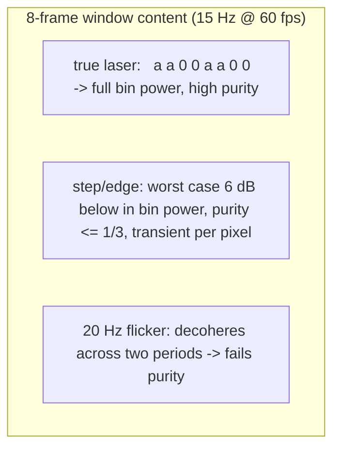
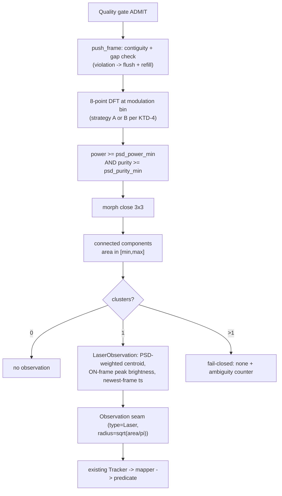

# Modulation Laser Detector (TRK-009a-d) - Plan

## Goal Capsule

- **Objective:** Build the ADR-005 modulation-correlation laser detector: PSD strategy benchmark (TRK-009a), rolling-buffer correlation engine (TRK-009b), cluster/centroid extraction (TRK-009c), and grace-period integration into the live pipeline (TRK-009d) — so `safe_for_control` clauses 3/5/7/8 run on detected lasers, not injected ones.
- **Authority hierarchy:** Accepted ADRs (ADR-005, ADR-007) > this plan > ticket bodies. Two deliberate deviations from ticket text are pre-decided here (KTD-1 window length, KTD-6 fail-closed disambiguation) with the reasoning recorded; note them in ticket logs at execution. Never cite ADR-009.
- **Execution profile:** Executor-agnostic (model-tier allocation policy): every design fork is pre-decided or given a mechanical decision rule; the executor should not reopen them. Three phases, each one `/goal`-run-sized, landed as one PR each, **merged strictly bottom-up with per-step retargeting** (see `docs/solutions/workflow/2026-07-18-stacked-pr-merge-order-recovery.md`).
- **Stop conditions:** Surface, never self-resolve: anything altering ADR-007 clause semantics; relaxing a test to pass; actuating hardware (the laser is NEVER fired by the executor — recordings are the operator's manual session); the ADR-005 amendment (U9) requires user sign-off before Phase B's PR merges.
- **Tail ownership:** Each phase ends `tools/pi5-remote-test.sh` green (repo root; both configs, zero warnings) before its PR. A failing replay gate is calibration signal: record counts, report, stop — verify the gate's scene premise before reading it as regression (`docs/solutions/workflow/2026-07-19-replay-gate-premises-are-scene-assertions.md`).

---

## Product Contract

### Summary

Implement the laser detector as an 8-frame (two-modulation-period) per-pixel spectral detector with purity gating, fail-closed multi-cluster handling, and window-integrity discipline (contiguity, staleness, wrap flush) — then wire it through the existing Observation→Tracker→predicate chain with the grace period joining the RUNNING conditions. All thresholds carry provisional defaults pending the operator's modulated-laser recording session; every gate that depends on real laser footage is labelled interim until then.

### Problem Frame

The v0.3 safety chain is complete but laser-blind: clauses 3/5/7/8 have only ever passed under injected observations. ADR-005 mandates temporal-signature detection because brightness cannot distinguish the laser from sunbeams, reflections, or a second pointer. The tickets sketch a 4-frame PSD window; planning-time flow analysis proved that window is insufficient — a single luminance step (any moving edge, any light switching) is mathematically identical to one modulation period in a 4-point DFT, and such a transient survives exactly `confirm_threshold` sliding windows, i.e. the ticket design as written contains a structural false-SAFE path. The plan resolves this with a two-period window (KTD-1), which is the load-bearing design decision of this cluster.

### Requirements

**Signal processing**

- R1. Detection is per-pixel spectral power at the configured modulation frequency over a window of two full modulation periods (8 frames at 60 fps / 15 Hz), phase-insensitive, computed only from quality-admitted frames.
- R2. A candidate pixel passes only if (a) its modulation-bin power exceeds `laser.psd_power_min` (absolute floor, intensity² units) AND (b) its spectral purity exceeds `laser.psd_purity_min`. The purity convention is pinned two-sided: modulation bin plus its conjugate over total AC power — `2·|X₂|² / (Σx² − (Σx)²/8)` for real input — so a pure on-frequency signal scores exactly 1.0 and the worst-case step scores 1/3. Purity makes the threshold transferable across gain/exposure; the floor rejects near-zero-signal noise where a ratio is meaningless. A bright step can exceed a dim laser's power floor, so purity — not bin power — is what rejects bright steps.
- R3. Step transients, moving edges, and 100 Hz-mains-aliased flicker must not produce observations: verified by dedicated synthetic sequences (step at every window offset, translating bright edge, 20 Hz interferer), each asserting zero detections. Two boundary characterisations accompany the suite: a fractional-phase true positive (edge-in-exposure sampling, worst case `[a, a/2, 0, a/2]`, ~3 dB bin-power loss) must still detect at the provisional thresholds, and an ambient source aliasing exactly onto the modulation bin (e.g. 45 Hz PWM) IS detected — expected behaviour, asserted as such and recorded as a residual exposure in the U9 amendment, not a failure.
- R4. Window integrity: the window is valid only when it holds 8 **contiguous** admitted frames (`FrameMetadata.sequence_number` adjacency) with no inter-frame capture gap above 1.5× the nominal frame period; violation (REJECT burst, camera stall, replay wrap) flushes the buffer and detection resumes only after a full refill. The replay loop-wrap signal is frame-aligned: `ReplaySource` reports the wrap through a `consume_wrap()` hook on `FrameSource` and the capture thread stamps a `wrapped` flag into that frame's `FrameMetadata` — a polled accessor would not be frame-aligned across the ring buffer, letting a window span the discontinuity.

**Extraction**

- R5. The thresholded mask is morphologically closed (3×3 ellipse), connected-component labelled, area-filtered to `[laser.min_cluster_size_px, laser.max_cluster_size_px]`, and each surviving cluster gets a PSD-power-weighted sub-pixel centroid plus peak brightness taken as the maximum over the window's ON frames (ON phase identified from the DFT argument — the latest frame is dark half the time).
- R6. Multi-cluster ambiguity is fail-closed: more than one surviving cluster emits **no** observation (ADR-007's false-on-ambiguity spirit; a modulated specular ghost is indistinguishable by PSD, R-04) and increments an ambiguity counter surfaced in `system_health`. Deviation from TRK-009c's brightest-wins acceptance, recorded at execution.
- R7. Zero or one `LaserObservation` per frame: sub-pixel centroid, psd power, purity, peak ON-brightness, timestamped with the **newest** window frame's capture timestamp. The observation-seam mapping sets `radius_px = sqrt(cluster_area/π)`.

**Lifecycle and integration**

- R8. Grace period and window fill are one mechanism: a single contiguous-admitted-push counter drives both; no output until `max(grace_period_cycles × frames_per_cycle, window_length)` contiguous admitted frames have been pushed — at the default (2 cycles) this exactly equals the window fill; load validation rejects values below 2 (KTD-8). `tracker_state` reaches RUNNING only when the existing first-admitted-frame condition AND grace completion both hold; RUNNING then latches (buffer flushes mid-run do not revert it — clauses 3/5 already fail safe during dropout).
- R9. The detector integrates at the established observation-build seam in the main loop (after quality gate, before tracking); laser observations flow through the existing type-keyed tracker, mapper (Z=0), snapshot builder, and predicate unchanged.
- R10. Performance: full per-frame detector cost (push + correlate + threshold + cluster + centroid) ≤ 4 ms on the Pi 5 in Release; no heap allocation after construction.

**Verification honesty**

- R11. On the existing recorded library (all six clips: no modulated laser exists in any footage), the detector produces **zero** laser observations and zero laser tracks — a real, non-vacuous detector-level FP gate, asserted alongside the existing `safe_for_control` gate so failures surface at the right layer.
- R12. A full-chain synthetic true-positive: a modulated dot painted into seeded-noise frames drives detection → tracking → mapping → predicate to `safe=true` through the production path (superseding the Phase C injection-based counterweight as the primary TP evidence; injection tests remain for clause isolation).
- R13. Stale-tail bound: after a settled laser departs, residual window power sustains fresh-timestamped detections at the old position for up to 4 frames (~67 ms); the predicate then flips false via the laser age clause (`age_max_ms` = 50 ms), giving a derived worst-case flip-to-false of ~117 ms. The synthetic sweep-away test asserts flip within 120 ms of departure — the honest derived bound. The consumer-side staleness rule does not cover the tail (it checks transport freshness, and stale-content messages are transport-fresh). Tightening to ≤100 ms would require a purity floor above 5/8 or a tighter laser `age_max_ms`; that option is put to the user in the U9 amendment.
- R14. All new config values are provisional-marked pending real modulated-laser recordings (operator session); replay gates over real laser footage are labelled interim until that library exists. Never tune thresholds to pass a gate.

### Success Criteria

- All three phase PRs Pi-green (both configs, zero warnings), merged bottom-up.
- The step/moving-edge/flicker rejection suite passes — the structural false-SAFE path is closed by the two-period window, per-pixel transience, and a load-time-validated purity floor above worst-case step purity, so no later threshold re-provenance can silently reopen it.
- Detector-level zero-FP over all six existing clips on the Pi; full-chain synthetic TP flips `safe=true` through real detection.
- Benchmark decision recorded in the TRK-009 parent log with Pi timings; detect cycle ≤ 4 ms.
- ADR-005 amendment (two-period window, ~133 ms latency) drafted and user-approved.

### Scope Boundaries

**In scope:** everything above; the shared synthetic modulation fixture; the `ReplaySource` wrap marker; viewer needs no change (laser rendering landed in VIEW-002).

**Deferred to follow-up work:**

- The operator's modulated-laser recording session (manual laser operation is the user's call; the executor never actuates) and the subsequent threshold re-provenance + interim-label removal.
- Rolling-shutter per-row alignment (ADR-005 risk): accepted degradation for v0.3; becomes a named validation item on the first real recordings.
- 22 Hz modulation at 90 fps (ADR-005 future); MCU/serial/controller work (ADR-008, LASER-001..004); ball-detector changes.
- Global exposure-step window invalidation: manual exposure is already pinned in config (ADR-004), so AGC steps are excluded by configuration; an explicit detector check is deferred until real footage shows the need.

---

## Planning Contract

### Key Technical Decisions

- KTD-1. **Two-period window (8 frames), not the ticket's 4.** A 4-point DFT cannot distinguish one modulation period from a single luminance step — `[0,0,a,a]` and the square wave have identical bin-1 power and identical (zero) bin-2, so any moving edge fires the detector and survives exactly 3 sliding windows (= `confirm_threshold`): a structural false-SAFE path found at planning time. Over 8 samples at the modulation bin (bin 2 of 8), the worst-case step (edge runs of 2 or 6 ON samples) carries bin power 2a² against the true signal's 8a² — 6 dB down — and since a bright step can beat a dim laser's power floor, step rejection is carried jointly by the purity gate (worst-case step purity 1/3 under the R2 convention) and per-pixel transience, with the R3 step-at-every-offset suite as the enforcing gate. A moving edge's *individual pixels* are transient (each sees one step, never sustained power), and off-frequency interferers decohere. Cost: first-detection latency doubles to ~133 ms — which exactly equals the existing 2-cycle grace period, and the latency-robust contract (consumer hovers on missing data) absorbs it. Requires the U9 ADR-005 amendment (user-signed). Window length is derived (`2 × fps / f_mod`), not a config field.
- KTD-2. **Purity + floor thresholding, normalised.** An absolute PSD threshold has no transferable physical meaning across gain/dot-size (the threshold-provenance learning). Detection requires `bin_power ≥ psd_power_min` AND purity ≥ `psd_purity_min` under the R2 two-sided convention. Both provisional until real footage — but the purity floor is structural: config validation rejects `psd_purity_min ≤ 0.4` (worst-case step purity is 1/3; the margin keeps step rejection intact), so no re-provenance sweep can cross it without an explicit design change. The provisional default should come from the truncated-window analysis (a departing dot's purity falls to ~1/3 by 4 residual signal frames), so the U5 stale-tail assertion holds without tuning.
- KTD-3. **Window integrity over timestamp resampling.** Frames are treated as uniformly spaced (frame-index model); what is guarded is *content* integrity: sequence-number contiguity, a 1.5×-period inter-frame gap ceiling, and the frame-aligned `wrapped` flag in `FrameMetadata` (R4), any violation flushing the buffer. Jitter is accepted; discontinuities are not.
- KTD-4. **Benchmark decides strategy by a mechanical rule (TRK-009a).** Option A (full-frame 8-point DFT per pixel) vs Option B (brightness-prefiltered candidates). Rule: B is admissible only if it detects every case A detects on the synthetic suite — including the dim-dot case at `psd_power_min` and the bright-clutter scene (dim modulated dot beside a larger, brighter saturated static blob: the "brightest pixel is not the laser" pitfall a brightness prefilter is most likely to fail); among admissible options choose lower p99 on the Pi; tie or ambiguity → A (no extra threshold, simpler). The *winner* is execution-time measured; the *rule* is closed here. Benchmark is a standalone binary under `benchmarks/` (new top-level dir, own CMake target, never linked into the suite), per the production-binary-oracle learning: it links `tracking_core_lib` and runs on the Pi.
- KTD-5. **Detector lives with its siblings.** `src/core/include/modulation_detector.hpp` + `src/core/tracking/modulation_detector.cpp` — the tickets' `src/core/detection/` path yields to the established detector convention (ball, marker detectors in `tracking/`).
- KTD-6. **Fail-closed disambiguation.** >1 surviving cluster ⇒ no observation + ambiguity counter (deterministic, conservative); replaces TRK-009c's brightest-wins (nondeterministic on OFF frames, and a modulated ghost near the ball is a false-SAFE contributor the single-laser track slot only partially blocks). Availability cost accepted: real laser + ghost simultaneously visible ⇒ unsafe, which is the correct direction.
- KTD-7. **One counter, latched RUNNING.** Contiguous-admitted pushes drive window fill and grace identically (they are the same 8 frames). RUNNING latches on first completion; later flushes surface as missing laser observations (clauses 3/5 fail safe) — the dwell anchor arming in the evaluator is untouched.
- KTD-8. **Config:** `laser` section gains `psd_power_min`, `psd_purity_min`, `min_cluster_size_px`, `max_cluster_size_px`, `grace_period_cycles` (default 2); the existing `modulation_frequency_hz`/`modulation_duty_cycle` fields are unchanged — the window length derives from them and `camera.target_fps`, no new frequency field. Validation per the established idiom plus two structural rules: `psd_purity_min > 0.4` (the KTD-2 floor) and `grace_period_cycles ≥ 2`, with detection start defined as `max(grace_period_cycles × frames_per_cycle, window_length)` contiguous admitted pushes so values above 2 delay first output rather than desynchronise the counter. All provisional-commented.

### High-Level Technical Design

Window timing — why two periods is the discriminator (each column one frame; window slides right):

Detector pipeline and integration seam:

Grace/RUNNING interlock:

```mermaid
stateDiagram-v2
  [*] --> Filling : startup / any flush
  Filling --> Detecting : 8 contiguous admitted pushes (= grace complete)
  Detecting --> Filling : contiguity/gap/wrap violation (flush)
  note right of Detecting : RUNNING latches at first entry;\nlater flushes do NOT revert it
```

### Sequencing

Phase A (U1–U2, TRK-009a) → Phase B (U3–U5 + U9 ADR sign-off, TRK-009b/c) → Phase C (U6–U8, TRK-009d). One PR per phase, bottom-up merge choreography stated in each handoff.

---

## Implementation Units

### Phase A — Benchmark (goal run 1)

### U1. Synthetic modulation fixture

- **Goal:** The shared test-sequence generator every subsequent unit uses.
- **Requirements:** R3, R12 groundwork.
- **Files:** create `tracking-core/tests/cpp_unit/modulation_fixture.hpp`; tests exercising it live with their consumers.
- **Approach:** Header-only helpers producing seeded-noise 640×480 frame sequences (the established `cv::RNG(seed)` idiom) with: a square-wave-modulated Gaussian dot (configurable position, radius, amplitude, phase, frequency); a static step (light-switch) at any window offset; a translating bright edge (moving ball surrogate, opaque per the composite-occlusion learning); an off-frequency interferer (20 Hz to model aliased mains); an on-bin interferer (ambient source aliasing exactly to the modulation frequency, e.g. 45 Hz PWM); a fractional-phase dot (edge-in-exposure sampling, worst case `[a, a/2, 0, a/2]`); a bright-clutter scene (dim modulated dot beside a larger, brighter saturated static blob); a saturated (clipped) modulated dot with asymmetric bloom; a settled-then-departing dot for the sweep-away case. Frames are indexed at nominal 60 fps with synthetic capture timestamps and gap injection hooks (for R4 tests).
- **Patterns to follow:** `tests/cpp_unit/calibration_fixture.hpp` (shared fixture precedent); seeded determinism throughout.
- **Test scenarios:** self-checks only — generated ON/OFF frame means differ by the configured amplitude; the dot's ground-truth centre is queryable. `Test expectation: fixture self-verification within its consumers' suites.`
- **Verification:** compiles into the test target; consumed by U2.

### U2. PSD strategy benchmark + decision (TRK-009a)

- **Goal:** Measure Options A and B on the Pi and apply the KTD-4 rule.
- **Requirements:** R10 (budget realism), KTD-4.
- **Files:** create `tracking-core/benchmarks/psd_strategy_bench.cpp`, `tracking-core/benchmarks/CMakeLists.txt`; modify `tracking-core/CMakeLists.txt` (add subdirectory, target excluded from tests).
- **Approach:** Standalone binary linking `tracking_core_lib`; implements both strategies over the U1 fixture sequences (true dot at 3 amplitudes including dim-at-floor; bright-clutter scene; step; moving edge; empty noise); reports per-frame mean/p99 for each strategy and a correctness table (detections per sequence). The benchmark target reaches the fixture via `target_include_directories` pointing at `tests/cpp_unit/` (header-only, no test-target link). Executor runs it on the Pi 5 (`build-release`), applies the KTD-4 rule, and records the decision + timings in `docs/tickets/TRK-009-modulation-laser-detector.md` Log — the plan does not pre-pick the winner.
- **Execution note:** the decision is made from on-target Release numbers only — dev-host timings are not evidence (production-binary-oracle learning).
- **Test scenarios:** `Test expectation: none — benchmark binary; its output is the deliverable.`
- **Verification:** Phase A gate — benchmark runs on the Pi, decision logged, `tools/pi5-remote-test.sh` (repo root) green both configs; PR opened.

### Phase B — Correlation engine and extraction (goal run 2)

### U3. ModulationDetector: window, DFT, thresholding

- **Goal:** The rolling buffer, integrity discipline, and per-pixel spectral gate (TRK-009b, per KTD-1/2/3).
- **Requirements:** R1, R2, R4 (partial: contiguity/staleness), R10.
- **Files:** create `tracking-core/src/core/include/modulation_detector.hpp`, `tracking-core/src/core/tracking/modulation_detector.cpp`, `tracking-core/tests/cpp_unit/test_modulation_detector.cpp`; modify `tracking-core/src/core/CMakeLists.txt`, `tracking-core/tests/cpp_unit/CMakeLists.txt`, `tracking-core/src/core/include/config.hpp`, `tracking-core/src/core/config.cpp`, `tracking-core/tests/cpp_unit/test_config.cpp`, `tracking-core/config/tracking_core.yaml` (KTD-8 fields: struct, template, loader validation, test YAML bases).
- **Approach:** Pre-allocated ring of 8 grayscale frames + parallel metadata (sequence, capture ns). `push_frame` enforces contiguity (sequence adjacency) and the 1.5×-period gap ceiling; violation flushes (resets the fill counter). Correlation per the U2-selected strategy: 8-point DFT at the modulation bin (the per-frame phase rotation is `e^{-jπn/2}` — four-phase accumulation, no complex library needed), producing power and purity maps into pre-allocated float Mats; threshold to a binary mask per KTD-2. Window length derived from config (`2 × camera.target_fps / laser.modulation_frequency_hz`, validated integral ≥ 8 at load). New config fields per KTD-8.
- **Patterns to follow:** `ball_detector.cpp` (pre-allocated working Mats, constructor sizing); config validation idiom in `config.cpp`.
- **Test scenarios:** true 15 Hz dot → power high, purity high at the dot, mask fires there only; static frame → zero mask; 30 Hz alternation → zero at the modulation bin; **step at every one of the 8 window offsets → zero detections** (the KTD-1 gate); translating edge → zero; 20 Hz interferer → zero (purity); dim dot at exactly `psd_power_min` boundary (ties fail, R11-style); fractional-phase dot detected at provisional thresholds (R3 boundary characterisation); on-bin interferer detected — asserted as expected behaviour, documented; REJECT-burst gap → flush, no output until refill; sequence gap → flush; capture-gap over ceiling → flush; no allocation after construction (constructor-then-loop test with the established idiom).
- **Verification:** unit suite green both configs locally.

### U4. Clustering, centroid, fail-closed disambiguation

- **Goal:** Mask → 0..1 `LaserObservation` (TRK-009c, per KTD-6).
- **Requirements:** R5, R6, R7.
- **Files:** modify `tracking-core/src/core/include/modulation_detector.hpp`, `tracking-core/src/core/tracking/modulation_detector.cpp`, `tracking-core/tests/cpp_unit/test_modulation_detector.cpp`.
- **Approach:** Morph close (3×3 ellipse, pre-built kernel) → `connectedComponentsWithStats` into pre-allocated buffers → area filter → PSD-power-weighted centroid per survivor → ON-frame peak brightness (ON frames identified from the DFT argument of the winning cluster's peak pixel) → fail-closed on >1 survivor with `ambiguous_detections()` counter. `LaserObservation { centroid_px, psd_power, purity, peak_brightness, capture_timestamp_ns (newest frame) }`.
- **Patterns to follow:** ball detector's contour-stage structure and reserve discipline.
- **Test scenarios:** single cluster → observation with sub-pixel centroid within 0.5 px of fixture ground truth; two passing clusters → none + counter increments; cluster below min / above max area → rejected; fragmenting marginal dot → morph close yields one cluster (stability); saturated bloomed dot → centroid bias asserted < 1 px (R13-adjacent systematic bound); brightness sampled from ON frames (construct a case where the newest frame is OFF and assert peak ≠ newest-frame value).
- **Verification:** unit suite green; Phase B continues.

### U5. Detector rejection suite hardening + wrap marker

- **Goal:** The R3/R4 adversarial suite as first-class gates, plus the `ReplaySource` wrap signal.
- **Requirements:** R3, R4 (wrap), R13 groundwork.
- **Files:** modify `tracking-core/src/core/include/replay_source.hpp`, `tracking-core/src/core/replay_source.cpp`, `tracking-core/src/core/include/frame_source.hpp`, `tracking-core/src/core/include/frame_metadata.hpp`, `tracking-core/src/core/capture_thread.cpp`, `tracking-core/tests/cpp_unit/test_modulation_detector.cpp`, `tracking-core/tests/cpp_unit/test_replay_source.cpp`.
- **Approach:** Frame-aligned wrap signal (R4, pre-decided): `FrameSource` gains `virtual bool consume_wrap()` (default false); `ReplaySource` overrides it to report a loop restart exactly once; `CaptureThread` stamps the result into a new `wrapped` flag in that frame's `FrameMetadata` (fits the ≤32-byte trivially-copyable static_assert). The main-loop seam (U6) flushes the detector when an admitted frame carries `wrapped`. A polled accessor is rejected: it is not frame-aligned across the ring buffer — pre-wrap frames can still be queued when it fires, letting a window span the discontinuity. Sweep-away sequence: settled dot for 2+ periods then instant departure; assert detector output ceases within 4 frames (the stale-tail bound R13 builds on) — the full-chain predicate assertion lands in U7.
- **Test scenarios:** loop wrap with looping fixture clip → `wrapped` stamped on exactly the first post-wrap frame's metadata; detector flushed on wrap emits nothing across the seam for a full refill; sweep-away tail ≤ 4 frames.
- **Verification:** Phase B gate — full suite green locally and on the Pi both configs; **U9 sign-off obtained**; PR opened (base: Phase A branch; merge choreography restated).

### U9. ADR-005 amendment (user sign-off; lands with Phase B)

- **Goal:** Record the two-period window as an ADR-005 amendment.
- **Requirements:** KTD-1's authority trail.
- **Dependencies:** U3 implemented (the amendment cites the shipped shape).
- **Files:** modify `docs/adr/ADR-005-active-laser-modulation.md` (append a dated clarification covering: detection window = two modulation periods; first-detection latency ~133 ms and derived worst-case flip-to-false after departure ~117 ms (R13); rationale: 4-point step-equivalence — a single-period window cannot distinguish a luminance step from the modulation, with 8-point worst-case separation 6 dB in bin power plus the purity floor; grace period and window fill unified; the integral-bin constraint — `2 × fps / f_mod` must be integral, so ADR-005's 14/16 Hz aliasing fallback becomes unrepresentable without a non-integer-bin correlator (Goertzel-class), recorded as an accepted constraint of the amendment; and the residual exposure to a single ambient source aliasing exactly onto the modulation bin, recorded beside the existing two-modulated-lasers constraint). The amendment also asks the user whether the ~117 ms reaction bound stands or whether the purity floor (>5/8) / laser `age_max_ms` should tighten it to ≤100 ms. Update `docs/tickets/TRK-009b` log noting the deviation.
- **Approach:** Draft appended per the ADR append-only convention (hysteresis-clarification precedent); **present to the user for approval before the Phase B PR merges** — this is a stop condition, not a formality.
- **Test scenarios:** `Test expectation: none — documentation.`
- **Verification:** user approval recorded in the commit that lands the amendment.

### Phase C — Integration and gates (goal run 3)

### U6. Grace/RUNNING interlock + main-loop integration (TRK-009d)

- **Goal:** The detector live in the pipeline; RUNNING gains its second condition.
- **Requirements:** R8, R9.
- **Files:** modify `tracking-core/src/core/main.cpp`, `tracking-core/src/core/include/snapshot_builder.hpp`, `tracking-core/src/core/tracking/snapshot_builder.cpp`, `tracking-core/tests/cpp_unit/test_snapshot_builder.cpp`, `tracking-core/tests/cpp_unit/test_pipeline_tracking.cpp`, `tracking-core/tests/cpp_unit/test_safety_replay.cpp` (harness callsites — see interface note).
- **Approach:** Main loop, after quality admit: `detector.push_frame(frame, metadata)`; `metadata.wrapped` → flush; `detect()` result mapped at the established observation seam (type Laser, `radius_px = sqrt(area/π)`, newest-frame timestamp) alongside the ball observation. `SnapshotBuilder` RUNNING condition becomes admitted-frame AND grace-complete, latched (KTD-7); the interface is pre-decided as `mark_frame_admitted(bool grace_complete)` with **no default argument**, so every callsite states its grace source explicitly — the existing SafetyHarness injection suites in `test_safety_replay.cpp` pass `true` (they predate the real detector) until U7 swaps the real detector into the new gates. The injection seam (tests) is unchanged and now coexists with real detection.
- **Patterns to follow:** the existing ball-observation build in `main.cpp`; the U4-seam comment discipline.
- **Test scenarios:** synthetic pipeline test (pipeline-tracking idiom): modulated dot in noise frames → laser track Provisional→Confirmed through the real detector; RUNNING only after 8 admitted frames (was: first frame) — existing snapshot-builder tests updated to the new condition; RUNNING stays latched across a mid-run flush; REJECT frames advance neither fill nor grace.
- **Verification:** unit + pipeline suites green both configs.

### U7. Full-chain gates: detector zero-FP + synthetic TP + sweep-away

- **Goal:** The evidence layer (R11–R13).
- **Requirements:** R11, R12, R13.
- **Files:** modify `tracking-core/tests/cpp_unit/test_safety_replay.cpp`.
- **Approach:** Extend the synchronous harness (synthetic clock) to run the real `ModulationDetector` in place of injection for these gates. (a) Detector-level FP gate: over every clip in `TRACKING_REPLAY_DIR` (all six — none contains a modulated laser), assert **zero laser observations and zero laser tracks**, with counts in the failure message and RecordProperty; this sits beside the existing `safe=true` gate so failures surface at the detector layer. (b) Full-chain TP: fixture-modulated dot + ball scene → predicate flips true through real detection after dwell (primary counterweight; injection variants retained for clause isolation). (c) Sweep-away: settled-aligned then departing dot → `safe` flips false within the derived 120 ms bound (R13: ≤4-frame stale tail + laser `age_max_ms`) on the synthetic clock.
- **Test scenarios:** as above, plus: harness wrap handling exercised — when the harness loops a clip it stamps `wrapped` on the first repeated frame (the same metadata path as U5) and asserts no detector firings span the wrap.
- **Verification:** all gates green on the Pi over the six-clip library.

### U8. Performance gate + ticket/board close-out

- **Goal:** R10 evidence and cluster bookkeeping.
- **Requirements:** R10; success criteria.
- **Files:** modify `tracking-core/tests/cpp_unit/test_safety_replay.cpp` (or a dedicated perf test beside the existing throughput test); `docs/tickets/TRK-009*.md`, `BOARD.md`.
- **Approach:** Release-asserted on-Pi timing: full detect cycle ≤ 4 ms and the main-loop 60 fps processing gate still green with the detector live (the existing throughput test now includes it via U6). Tickets TRK-009/a/b/c/d → done with log entries (including the KTD-1 and KTD-6 deviations); `board_check` green.
- **Test scenarios:** detect-cycle budget (Release-asserted, Debug records); existing `PipelineThroughput` remains ≥ 60 fps with the detector included.
- **Verification:** Phase C gate — `tools/pi5-remote-test.sh` green both configs; PR opened; merge choreography restated.

---

## Verification Contract

| Gate | Command / assertion | Applies |
|---|---|---|
| Dev build + unit tests | `cmake -S . -B build && cmake --build build && (cd build && ctest --output-on-failure)` from `tracking-core/` | every unit |
| Rejection suite | step-at-every-offset, moving-edge, 20 Hz, wrap: zero detections | U3, U5 |
| On-target gate | `tools/pi5-remote-test.sh` (repo root) — both configs, zero warnings | every phase end |
| Detector zero-FP (real footage) | zero laser observations/tracks over all six recorded clips, on-Pi | Phase C |
| Full-chain synthetic TP | `safe=true` via real detection after dwell | Phase C |
| Sweep-away | flip-to-false ≤ 120 ms (derived bound, R13) on the synthetic clock | Phase C |
| Perf | detect cycle ≤ 4 ms; pipeline ≥ 60 fps with detector live (Pi, Release) | Phase C |
| Benchmark decision | KTD-4 rule applied to on-Pi numbers, logged in TRK-009 | Phase A |

House rules bind every gate: never relax an assertion; a replay-gate failure is calibration signal — verify the scene premise first, record counts, stop.

---

## Definition of Done

- U1–U9 landed across three bottom-up-merged PRs, each phase Pi-green (both configs, zero warnings) first.
- The ADR-005 amendment is user-approved and merged with Phase B.
- Every Verification Contract gate passes; the detector-level zero-FP gate runs over all six clips.
- Config `laser` section extended with provisional-commented values; template, loader validation, and `test_config.cpp` bases updated per the established idiom.
- Tickets TRK-009 + a/b/c/d done with deviation notes; `board_check` green; abandoned experiments removed before each PR.
- Recorded deferrals stand: operator recording session + threshold re-provenance + interim-label removal; rolling-shutter validation item; exposure-step check.

---

## Risks & Dependencies

- **The step-equivalence fix is planning-time mathematics, not yet empirical.** The 8-point analysis (6 dB worst-case bin-power separation, step purity ≤ 1/3 under the R2 convention) is derived, and the rejection suite enforces it synthetically — but real-footage confirmation waits on the operator's recording session. Until then every laser gate carries the interim label. The mathematics is falsifiable by U3's step-at-every-offset suite on day one.
- **Provisional thresholds on an untested modality.** `psd_power_min`/`psd_purity_min` defaults are guesses; the purity normalisation (KTD-2) is what makes later re-provenance a bounded sweep (production-binary oracle, probe pattern) instead of a redesign.
- **Latency budget consumption.** ~133 ms first-detection; after departure, the ≤67 ms stale tail plus the 50 ms laser age clause give ~117 ms worst-case flip-to-false (R13 gate at 120 ms). The consumer-side staleness rule does not cover the tail — it checks transport freshness, not content freshness; the age clause is what closes it. The ADR amendment states the numbers and puts the tighten-to-100 ms option to the user.
- **Ambiguity fail-closed availability.** Rooms with strong specular surfaces may see frequent no-observation states; the ambiguity counter makes this observable in `system_health` rather than silent.
- **The recorded library is laser-free by scene truth, not by verification.** R11's gate premise rests on the same class of assumption the premise-drift learning warns about; the scene photograph shows no laser source, and the gate comment must date that verification.
